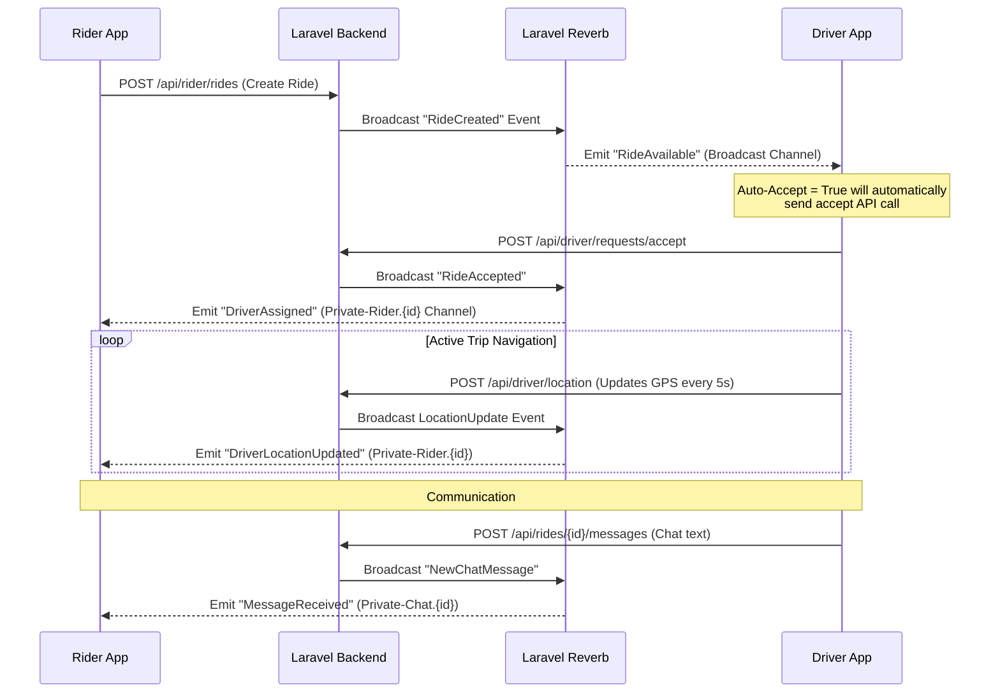

# UEY (Premium Mobility) Backend Architecture Analysis
*Refined based on the Figma Design PDF (`UEY new.pdf`)*

This analysis maps the client's visual layouts directly to a database schema and Laravel API structure. By analyzing the screens for the Rider and Driver workflows, we have identified several specific requirements (such as driver auto-accept settings, safety checklists, user notifications, and wallet top-ups/cash-outs).

---

## Part 1: Refined Database Design (MySQL Schema)

Here is the updated entity-relationship model designed to support all screens in the PDF, including geospatial tracking, driver performance metrics, safety checklists, chat, and support logs.

### 1. `users` Table
Unified user account table for riders, drivers, and admins.
```sql
CREATE TABLE users (
    id BIGINT UNSIGNED AUTO_INCREMENT PRIMARY KEY,
    name VARCHAR(255) NOT NULL,
    email VARCHAR(255) UNIQUE,
    phone VARCHAR(20) UNIQUE NOT NULL,
    password VARCHAR(255) NOT NULL,
    role ENUM('rider', 'driver', 'admin') DEFAULT 'rider' NOT NULL,
    avatar_url VARCHAR(2048) NULL,
    status ENUM('active', 'suspended', 'pending_approval') DEFAULT 'active' NOT NULL,
    remember_token VARCHAR(100) NULL,
    email_notifications BOOLEAN DEFAULT TRUE NOT NULL,
    sms_notifications BOOLEAN DEFAULT TRUE NOT NULL,
    push_notifications BOOLEAN DEFAULT TRUE NOT NULL,
    created_at TIMESTAMP NULL,
    updated_at TIMESTAMP NULL,
    INDEX idx_user_role_status (role, status)
);
```

### 2. `driver_profiles` Table
Stores driver metrics (such as Acceptance Rate and On-Time Rate shown in the "Driver Profile" screen), settings, and active GPS coordinates.
```sql
CREATE TABLE driver_profiles (
    id BIGINT UNSIGNED AUTO_INCREMENT PRIMARY KEY,
    user_id BIGINT UNSIGNED NOT NULL,
    license_number VARCHAR(100) UNIQUE NOT NULL,
    license_expiry DATE NOT NULL,
    is_online BOOLEAN DEFAULT FALSE NOT NULL,
    rating DECIMAL(3,2) DEFAULT 5.00 NOT NULL,
    experience_years DECIMAL(3,1) DEFAULT 0.0 NOT NULL, -- e.g., "2.5 Years"
    acceptance_rate DECIMAL(5,2) DEFAULT 100.00 NOT NULL, -- e.g., "98%"
    ontime_rate DECIMAL(5,2) DEFAULT 100.00 NOT NULL, -- e.g., "99%"
    total_online_hours INT UNSIGNED DEFAULT 0 NOT NULL, -- e.g., "2,156 hrs"
    
    -- Driver Preferences (from Settings screen)
    default_navigation VARCHAR(50) DEFAULT 'google_maps' NOT NULL, -- e.g., 'Waze', 'Google Maps'
    auto_accept BOOLEAN DEFAULT FALSE NOT NULL, -- "Auto-Accept Requests" toggle
    
    current_lat DECIMAL(10, 8) NULL,
    current_lng DECIMAL(11, 8) NULL,
    bearing DECIMAL(5, 2) NULL, -- Angle driver is facing (0-360 deg) for smooth map rotation
    last_located_at TIMESTAMP NULL,
    created_at TIMESTAMP NULL,
    updated_at TIMESTAMP NULL,
    
    FOREIGN KEY (user_id) REFERENCES users(id) ON DELETE CASCADE,
    INDEX idx_driver_online (is_online),
    INDEX idx_driver_location (current_lat, current_lng)
);
```

### 3. `vehicle_types` Table
Defines vehicle categories (e.g., Standard, Premium, SUV, Moto) and pricing structures.
```sql
CREATE TABLE vehicle_types (
    id BIGINT UNSIGNED AUTO_INCREMENT PRIMARY KEY,
    name VARCHAR(50) UNIQUE NOT NULL, -- e.g., 'Standard', 'Premium'
    capacity INT UNSIGNED NOT NULL DEFAULT 4,
    base_fare DECIMAL(10, 2) NOT NULL, -- Starting fare
    per_km_rate DECIMAL(10, 2) NOT NULL,
    per_minute_rate DECIMAL(10, 2) NOT NULL,
    minimum_fare DECIMAL(10, 2) NOT NULL,
    commission_percentage DECIMAL(5, 2) NOT NULL DEFAULT 20.00,
    icon_url VARCHAR(2048) NOT NULL,
    active BOOLEAN DEFAULT TRUE NOT NULL,
    created_at TIMESTAMP NULL,
    updated_at TIMESTAMP NULL
);
```

### 4. `vehicles` Table
Details of the vehicle linked to the driver (e.g., "Tesla Model 3, White, ABC 123, 2023").
```sql
CREATE TABLE vehicles (
    id BIGINT UNSIGNED AUTO_INCREMENT PRIMARY KEY,
    driver_id BIGINT UNSIGNED NOT NULL,
    vehicle_type_id BIGINT UNSIGNED NOT NULL,
    make VARCHAR(50) NOT NULL, -- e.g., 'Tesla'
    model VARCHAR(50) NOT NULL, -- e.g., 'Model 3'
    year YEAR NOT NULL,
    color VARCHAR(30) NOT NULL, -- e.g., 'White'
    plate_number VARCHAR(20) UNIQUE NOT NULL, -- e.g., 'ABC 123'
    status ENUM('pending', 'approved', 'rejected') DEFAULT 'pending' NOT NULL,
    created_at TIMESTAMP NULL,
    updated_at TIMESTAMP NULL,
    FOREIGN KEY (driver_id) REFERENCES driver_profiles(id) ON DELETE CASCADE,
    FOREIGN KEY (vehicle_type_id) REFERENCES vehicle_types(id)
);
```

### 5. `driver_documents` Table
Verification documents upload list (License, Registration, Insurance, Background Check).
```sql
CREATE TABLE driver_documents (
    id BIGINT UNSIGNED AUTO_INCREMENT PRIMARY KEY,
    driver_id BIGINT UNSIGNED NOT NULL,
    document_type ENUM('license', 'registration', 'insurance', 'background_check') NOT NULL,
    file_path VARCHAR(2048) NOT NULL,
    status ENUM('pending', 'approved', 'rejected') DEFAULT 'pending' NOT NULL,
    rejection_reason VARCHAR(255) NULL,
    expires_at DATE NULL,
    created_at TIMESTAMP NULL,
    updated_at TIMESTAMP NULL,
    FOREIGN KEY (driver_id) REFERENCES driver_profiles(id) ON DELETE CASCADE
);
```

### 6. `rides` Table
Tracks ride states and fare breakdowns. Includes the **Safety Checklist** items from the driver workflow.
```sql
CREATE TABLE rides (
    id BIGINT UNSIGNED AUTO_INCREMENT PRIMARY KEY,
    rider_id BIGINT UNSIGNED NOT NULL,
    driver_id BIGINT UNSIGNED NULL, -- Nullable until driver accepts
    vehicle_type_id BIGINT UNSIGNED NOT NULL,
    
    pickup_address VARCHAR(255) NOT NULL,
    pickup_lat DECIMAL(10, 8) NOT NULL,
    pickup_lng DECIMAL(11, 8) NOT NULL,
    
    dropoff_address VARCHAR(255) NOT NULL,
    dropoff_lat DECIMAL(10, 8) NOT NULL,
    dropoff_lng DECIMAL(11, 8) NOT NULL,
    
    status ENUM('searching', 'accepted', 'arriving', 'arrived', 'in_progress', 'completed', 'cancelled') DEFAULT 'searching' NOT NULL,
    otp CHAR(4) NOT NULL, -- 4-digit verification code to start the ride
    
    -- Driver Safety Checklist (from Passenger On Board screen)
    safety_passenger_verified BOOLEAN DEFAULT FALSE NOT NULL,
    safety_seatbelt_fastened BOOLEAN DEFAULT FALSE NOT NULL,
    safety_route_confirmed BOOLEAN DEFAULT FALSE NOT NULL,
    
    estimated_distance_km DECIMAL(8, 2) NOT NULL,
    estimated_duration_min INT UNSIGNED NOT NULL,
    estimated_fare DECIMAL(10, 2) NOT NULL,
    
    actual_distance_km DECIMAL(8, 2) NULL,
    actual_duration_min INT UNSIGNED NULL,
    
    -- Fare Breakdown (from Trip Completed & Invoice screens)
    base_fare DECIMAL(10, 2) DEFAULT 0.00 NOT NULL,
    distance_fare DECIMAL(10, 2) DEFAULT 0.00 NOT NULL,
    time_fare DECIMAL(10, 2) DEFAULT 0.00 NOT NULL,
    surge_multiplier DECIMAL(3, 2) DEFAULT 1.00 NOT NULL, -- e.g., 1.2x
    surge_fare DECIMAL(10, 2) DEFAULT 0.00 NOT NULL,
    service_fee DECIMAL(10, 2) DEFAULT 0.00 NOT NULL,
    discount_amount DECIMAL(10, 2) DEFAULT 0.00 NOT NULL,
    total_fare DECIMAL(10, 2) DEFAULT 0.00 NOT NULL, -- Final charged amount
    
    payment_method ENUM('cash', 'card', 'wallet') NOT NULL DEFAULT 'card',
    payment_status ENUM('pending', 'paid', 'failed', 'refunded') NOT NULL DEFAULT 'pending',
    
    cancellation_reason VARCHAR(255) NULL,
    cancelled_by ENUM('rider', 'driver', 'system') NULL,
    
    scheduled_at TIMESTAMP NULL, -- Populated for "Schedule for later" bookings
    accepted_at TIMESTAMP NULL,
    arrived_at TIMESTAMP NULL,
    started_at TIMESTAMP NULL,
    ended_at TIMESTAMP NULL,
    created_at TIMESTAMP NULL,
    updated_at TIMESTAMP NULL,
    
    FOREIGN KEY (rider_id) REFERENCES users(id),
    FOREIGN KEY (driver_id) REFERENCES users(id),
    FOREIGN KEY (vehicle_type_id) REFERENCES vehicle_types(id),
    INDEX idx_ride_status (status)
);
```

### 7. `ride_requests` Table
Handles matching broadcasts to nearby drivers.
```sql
CREATE TABLE ride_requests (
    id BIGINT UNSIGNED AUTO_INCREMENT PRIMARY KEY,
    ride_id BIGINT UNSIGNED NOT NULL,
    driver_id BIGINT UNSIGNED NOT NULL, -- User ID of the driver receiving request
    status ENUM('pending', 'accepted', 'declined', 'expired') DEFAULT 'pending' NOT NULL,
    created_at TIMESTAMP NULL,
    updated_at TIMESTAMP NULL,
    FOREIGN KEY (ride_id) REFERENCES rides(id) ON DELETE CASCADE,
    FOREIGN KEY (driver_id) REFERENCES users(id),
    INDEX idx_request_lookup (driver_id, status)
);
```

### 8. `payments` Table
Records payment gateway transactions.
```sql
CREATE TABLE payments (
    id BIGINT UNSIGNED AUTO_INCREMENT PRIMARY KEY,
    ride_id BIGINT UNSIGNED NOT NULL,
    transaction_id VARCHAR(100) UNIQUE NULL, -- stripe_charge_id
    amount DECIMAL(10, 2) NOT NULL,
    method ENUM('cash', 'card', 'wallet') NOT NULL,
    status ENUM('pending', 'completed', 'failed', 'refunded') DEFAULT 'pending' NOT NULL,
    created_at TIMESTAMP NULL,
    updated_at TIMESTAMP NULL,
    FOREIGN KEY (ride_id) REFERENCES rides(id)
);
```

### 9. `reviews` Table
Allows riders to rate drivers (and vice-versa).
```sql
CREATE TABLE reviews (
    id BIGINT UNSIGNED AUTO_INCREMENT PRIMARY KEY,
    ride_id BIGINT UNSIGNED NOT NULL,
    reviewer_id BIGINT UNSIGNED NOT NULL,
    reviewee_id BIGINT UNSIGNED NOT NULL,
    rating INT UNSIGNED NOT NULL CHECK (rating >= 1 AND rating <= 5),
    comment TEXT NULL,
    created_at TIMESTAMP NULL,
    updated_at TIMESTAMP NULL,
    FOREIGN KEY (ride_id) REFERENCES rides(id),
    FOREIGN KEY (reviewer_id) REFERENCES users(id),
    FOREIGN KEY (reviewee_id) REFERENCES users(id)
);
```

### 10. `wallets` & `wallet_transactions` Tables
Tracks wallet top-ups (Riders) and earnings/cashouts (Drivers).
```sql
CREATE TABLE wallets (
    id BIGINT UNSIGNED AUTO_INCREMENT PRIMARY KEY,
    user_id BIGINT UNSIGNED UNIQUE NOT NULL,
    balance DECIMAL(10, 2) DEFAULT 0.00 NOT NULL,
    created_at TIMESTAMP NULL,
    updated_at TIMESTAMP NULL,
    FOREIGN KEY (user_id) REFERENCES users(id) ON DELETE CASCADE
);

CREATE TABLE wallet_transactions (
    id BIGINT UNSIGNED AUTO_INCREMENT PRIMARY KEY,
    wallet_id BIGINT UNSIGNED NOT NULL,
    amount DECIMAL(10, 2) NOT NULL, -- Positive for credit, negative for debit
    type ENUM('deposit', 'ride_payment', 'ride_earnings', 'cashout', 'refund') NOT NULL,
    reference_id VARCHAR(100) NULL, -- Linked Ride ID or Payout transaction ID
    status ENUM('pending', 'completed', 'failed') DEFAULT 'completed' NOT NULL,
    created_at TIMESTAMP NULL,
    updated_at TIMESTAMP NULL,
    FOREIGN KEY (wallet_id) REFERENCES wallets(id) ON DELETE CASCADE
);
```

### 11. `promo_codes` Table
Handles coupon and discount rules.
```sql
CREATE TABLE promo_codes (
    id BIGINT UNSIGNED AUTO_INCREMENT PRIMARY KEY,
    code VARCHAR(50) UNIQUE NOT NULL,
    discount_type ENUM('fixed', 'percentage') NOT NULL,
    discount_value DECIMAL(10, 2) NOT NULL,
    max_discount DECIMAL(10, 2) NULL,
    min_ride_value DECIMAL(10, 2) DEFAULT 0.00 NOT NULL,
    expires_at TIMESTAMP NOT NULL,
    usage_limit INT UNSIGNED NULL,
    used_count INT UNSIGNED DEFAULT 0 NOT NULL,
    is_active BOOLEAN DEFAULT TRUE NOT NULL,
    created_at TIMESTAMP NULL,
    updated_at TIMESTAMP NULL
);
```

### 12. `chat_messages` Table
Tracks real-time messages exchanged during active rides.
```sql
CREATE TABLE chat_messages (
    id BIGINT UNSIGNED AUTO_INCREMENT PRIMARY KEY,
    ride_id BIGINT UNSIGNED NOT NULL,
    sender_id BIGINT UNSIGNED NOT NULL,
    message_text TEXT NOT NULL,
    is_read BOOLEAN DEFAULT FALSE NOT NULL,
    created_at TIMESTAMP NULL,
    updated_at TIMESTAMP NULL,
    FOREIGN KEY (ride_id) REFERENCES rides(id) ON DELETE CASCADE,
    FOREIGN KEY (sender_id) REFERENCES users(id)
);
```

### 13. `notifications` Table
Stores notification feeds (e.g. "Earn +£450 Bonus Today!", "Surge Pricing Active").
```sql
CREATE TABLE notifications (
    id BIGINT UNSIGNED AUTO_INCREMENT PRIMARY KEY,
    user_id BIGINT UNSIGNED NOT NULL,
    title VARCHAR(255) NOT NULL,
    body TEXT NOT NULL,
    type ENUM('earnings', 'trips', 'updates') DEFAULT 'updates' NOT NULL,
    read_at TIMESTAMP NULL,
    created_at TIMESTAMP NULL,
    updated_at TIMESTAMP NULL,
    FOREIGN KEY (user_id) REFERENCES users(id) ON DELETE CASCADE
);
```

### 14. `emergency_logs` Table
Logs emergency trigger actions.
```sql
CREATE TABLE emergency_logs (
    id BIGINT UNSIGNED AUTO_INCREMENT PRIMARY KEY,
    ride_id BIGINT UNSIGNED NOT NULL,
    user_id BIGINT UNSIGNED NOT NULL,
    latitude DECIMAL(10, 8) NOT NULL,
    longitude DECIMAL(11, 8) NOT NULL,
    resolved BOOLEAN DEFAULT FALSE NOT NULL,
    created_at TIMESTAMP NULL,
    updated_at TIMESTAMP NULL,
    FOREIGN KEY (ride_id) REFERENCES rides(id) ON DELETE CASCADE,
    FOREIGN KEY (user_id) REFERENCES users(id)
);
```

---

## Part 2: Laravel API Endpoint Mapping (45 Endpoints)

The Laravel API endpoints are divided by actor modules.

### 1. Shared Authentication & Profile APIs
*   `POST /api/register` – Create user account.
*   `POST /api/login` – Authenticate credentials and return token.
*   `POST /api/otp/send` – Request phone verification SMS OTP.
*   `POST /api/otp/verify` – Verify 4-digit code.
*   `POST /api/logout` – Invalidate active token.
*   `GET /api/profile` – Fetch profile details.
*   `PUT /api/profile` – Update profile details, avatar, and notification toggles.
*   `POST /api/password/reset` – Request password recovery.

### 2. Rider API Endpoints
*   `GET /api/rider/dashboard` – Fetch upcoming bookings and recent location history.
*   `GET /api/rider/vehicle-types` – List vehicle types and active base pricing.
*   `POST /api/rider/fare-estimate` – Estimate fare based on vehicle categories, distances, and surge pricing.
*   `POST /api/rider/rides` – Create a ride request (starts as `searching`).
*   `POST /api/rider/rides/schedule` – Schedule a ride for a future timestamp.
*   `GET /api/rider/rides/current` – Get current active ride status.
*   `POST /api/rider/rides/{ride}/cancel` – Cancel an active ride request.
*   `GET /api/rider/rides/{ride}/driver` – Get public stats of assigned driver.
*   `GET /api/rider/rides/history` – Paginated list of past trips.
*   `GET /api/rider/rides/{ride}/receipt` – Details for receipt generation.
*   `POST /api/rider/rides/{ride}/review` – Rate driver (1-5 stars) and submit comments.
*   `POST /api/rider/promos/validate` – Check coupon eligibility.
*   `GET /api/rider/wallet` – Get balance and transactions.
*   `POST /api/rider/wallet/topup` – Load balance into the wallet via card token.
*   `GET /api/rider/payment-methods` – List saved cards via Stripe Customer.
*   `POST /api/rider/payment-methods` – Store a payment card token.

### 3. Driver API Endpoints
*   `POST /api/driver/onboarding/documents` – Upload license, registration, background checks, and insurance.
*   `GET /api/driver/onboarding/status` – View approval status of submitted documents.
*   `PUT /api/driver/status` – Toggle online/offline status (`is_online`).
*   `POST /api/driver/location` – Update active latitude, longitude, and bearing.
*   `PUT /api/driver/settings` – Set driver settings (Default Navigation, Auto-Accept toggle).
*   `GET /api/driver/requests` – Fetch active ride broadcasts (if not using WebSockets).
*   `POST /api/driver/requests/{request}/accept` – Accept broadcasted request.
*   `POST /api/driver/requests/{request}/decline` – Decline broadcasted request.
*   `POST /api/driver/rides/{ride}/arrive` – Mark arrival at the pickup point.
*   `POST /api/driver/rides/{ride}/start` – Start ride (validates `passenger_verified`, `seatbelt_fastened`, `route_confirmed`).
*   `POST /api/driver/rides/{ride}/complete` – Trigger destination arrival and calculate final fare metrics.
*   `GET /api/driver/earnings/summary` – Weekly performance aggregation data.
*   `GET /api/driver/rides/history` – Fetch details of completed driver trips.
*   `POST /api/driver/rides/{ride}/review` – Submit rider rating.
*   `POST /api/driver/wallet/cashout` – Withdraw wallet balance.
*   `GET /api/driver/notifications` – Paginated dashboard notifications list (All, Earnings, Trips, Updates).

### 4. Communications & Safety APIs (Shared Rider/Driver)
*   `GET /api/rides/{ride}/messages` – Fetch active in-ride chat history.
*   `POST /api/rides/{ride}/messages` – Send message (broadcasts to WebSocket).
*   `POST /api/rides/{ride}/call` – Log/Initiate a masked phone call session.
*   `POST /api/rides/{ride}/emergency` – Log immediate emergency 911 dispatch.

### 5. Admin API Endpoints
*   `GET /api/admin/drivers` – List, search, and filter drivers.
*   `GET /api/admin/riders` – List, search, and filter riders.
*   `GET /api/admin/documents/pending` – Fetch pending documents.
*   `POST /api/admin/documents/{document}/verify` – Approve or reject documents.
*   `GET /api/admin/rides` – Live system activity log.
*   `PUT /api/admin/pricing/{vehicle_type}` – Adjust pricing factors.
*   `POST /api/admin/promos` – Create promo coupons.

---

## Part 3: Real-Time Communication Workflow (Laravel Reverb)

Real-time events sync through Laravel Reverb based on the schema mapping:


