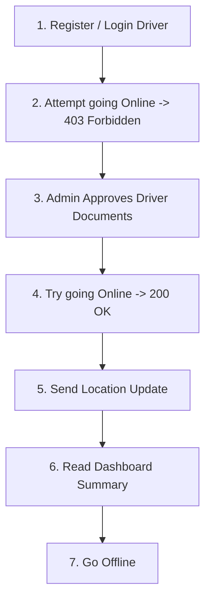
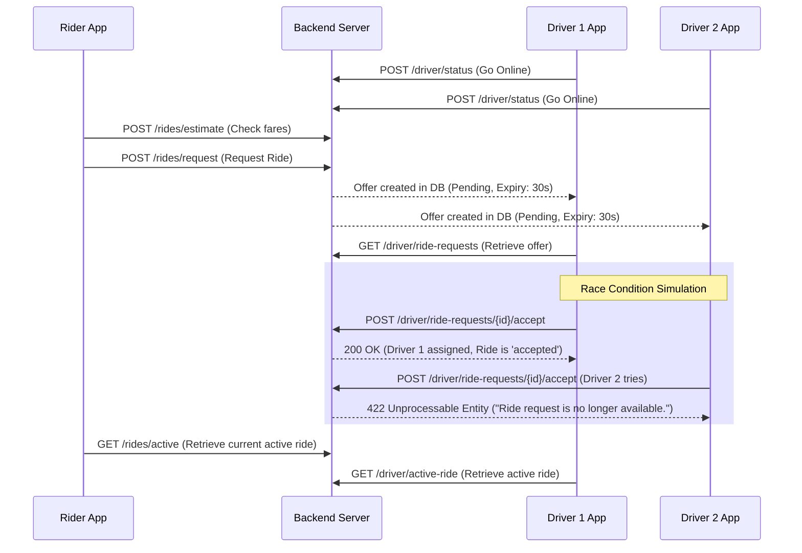

# UEY Premium Mobility - Postman Testing Guide
### Phase 4: Driver Availability & Live Location Testing Flow

This guide describes how to verify the **Driver Availability and Live Location** API endpoints in Postman.

---

## 1. Environment Setup
Configure your Postman environment with the following variables:
*   `base_url`: `http://uey.test/api/v1` (or local port URL e.g. `http://localhost:8000/api/v1`)
*   `driver_token`: The Bearer token received after driver registration or login.
*   `admin_token`: The Bearer token received after admin login.

---

## 2. API Endpoints Reference

### 1. Toggle Driver Availability Status
*   **Method / Route:** `POST {{base_url}}/driver/status`
*   **Headers:**
    *   `Accept: application/json`
    *   `Content-Type: application/json`
    *   `Authorization: Bearer {{driver_token}}`
*   **Body (JSON):**
    ```json
    {
      "is_online": true
    }
    ```
*   **Expected Response (200 OK):**
    ```json
    {
      "success": true,
      "message": "Driver status updated successfully.",
      "is_online": true
    }
    ```

### 2. Update Live Location Coordinates
*   **Method / Route:** `POST {{base_url}}/driver/location`
*   **Headers:**
    *   `Accept: application/json`
    *   `Content-Type: application/json`
    *   `Authorization: Bearer {{driver_token}}`
*   **Body (JSON):**
    ```json
    {
      "current_latitude": 51.5204,
      "current_longitude": -0.1482,
      "bearing": 120.5
    }
    ```
*   **Expected Response (200 OK):**
    ```json
    {
      "success": true,
      "message": "Driver location updated successfully."
    }
    ```

### 3. Get Driver Dashboard Details
*   **Method / Route:** `GET {{base_url}}/driver/dashboard`
*   **Headers:**
    *   `Accept: application/json`
    *   `Authorization: Bearer {{driver_token}}`
*   **Expected Response (200 OK):**
    ```json
    {
      "success": true,
      "dashboard": {
        "driver_profile_id": 1,
        "is_online": true,
        "rating": 5.0,
        "acceptance_rate": 100.0,
        "ontime_rate": 100.0,
        "completed_rides_count": 0,
        "earnings_summary": {
          "today": 0.0,
          "this_week": 0.0,
          "total": 0.0
        },
        "profile": {
          "name": "Bob Driver",
          "email": "bob.driver@example.com",
          "phone": "+447911999999",
          "avatar_url": null
        },
        "last_seen_at": "2026-06-23T19:12:00+00:00"
      }
    }
    ```

---

## 3. Recommended Testing Sequence (Step-by-Step)

Follow this order to test the full module including validation boundary checks:



### Step 1: Register and Login Driver
1.  Call `POST {{base_url}}/register/driver` with Bob's details.
2.  Store the returned token in `driver_token`. At this point, Bob's user status is `pending_approval`.

### Step 2: Test Validation (Go Online fails when unapproved)
1.  Make a `POST {{base_url}}/driver/status` request with `is_online: true` using `driver_token`.
2.  Verify the server rejects the request with a **403 Forbidden** status:
    *   *Payload:* `{"success":false,"message":"Only active approved drivers can go online."}`

### Step 3: Approve Driver via Admin
*(If running locally, you can approve Bob's documents via DB updates or by simulating the admin approvals:)*
1.  Login as admin (`POST {{base_url}}/login` with admin credentials) and save token to `admin_token`.
2.  Get Bob's pending documents via `GET {{base_url}}/admin/documents/pending`.
3.  For each required document ID (driving license, vehicle registration, and insurance), call `POST {{base_url}}/admin/documents/{id}/verify` with `status: "approved"`.
4.  Confirm Bob's status becomes `active` once the last document is approved.

### Step 4: Toggle Status Online
1.  Retry `POST {{base_url}}/driver/status` with `is_online: true` using `driver_token`.
2.  Verify the response returns **200 OK** and shows `"is_online": true`.
3.  *(Behind the scenes, this stores Bob's coordinates in the Redis GEO index `drivers:locations`)*.

### Step 5: Send Live Location Updates
1.  Make a `POST {{base_url}}/driver/location` request using `driver_token` with new latitude and longitude values (e.g. `51.5210`, `-0.1490`).
2.  Verify the response returns **200 OK**.
3.  *(Behind the scenes, Bob's coordinates are immediately synced in the Redis GEO index)*.

### Step 6: View Driver Dashboard
1.  Perform a `GET {{base_url}}/driver/dashboard` request using `driver_token`.
2.  Verify that `is_online` is `true` and that `rating`, `acceptance_rate`, and `ontime_rate` are returned correctly alongside his user profile summary.

### Step 7: Go Offline
1.  Trigger `POST {{base_url}}/driver/status` with `is_online: false`.
2.  Verify that `is_online` in the response is now `false`.
3.  *(Behind the scenes, Bob's record is removed from the Redis GEO index `drivers:locations`)*.

---

## 4. Phase 5: Ride Booking & Matching Engine Reference

### 1. Estimate Fare (Rider)
*   **Method / Route:** `POST {{base_url}}/rides/estimate`
*   **Headers:**
    *   `Accept: application/json`
    *   `Content-Type: application/json`
    *   `Authorization: Bearer {{rider_token}}`
*   **Body (JSON):**
    ```json
    {
      "pickup_latitude": 51.5074,
      "pickup_longitude": -0.1278,
      "destination_latitude": 51.5204,
      "destination_longitude": -0.1482
    }
    ```
*   **Expected Response (200 OK):**
    ```json
    {
      "success": true,
      "estimates": [
        {
          "vehicle_type_id": 1,
          "name": "Standard",
          "capacity": 4,
          "estimated_distance": 1.99,
          "estimated_duration": 3,
          "estimated_fare": 9.48
        }
      ]
    }
    ```

### 2. Request Ride (Rider)
*   **Method / Route:** `POST {{base_url}}/rides/request`
*   **Headers:**
    *   `Accept: application/json`
    *   `Content-Type: application/json`
    *   `Authorization: Bearer {{rider_token}}`
*   **Body (JSON):**
    ```json
    {
      "pickup_latitude": 51.5074,
      "pickup_longitude": -0.1278,
      "pickup_address": "London Eye, London",
      "destination_latitude": 51.5204,
      "destination_longitude": -0.1482,
      "destination_address": "Regent's Park, London",
      "vehicle_type_id": 1
    }
    ```
*   **Expected Response (201 Created):**
    ```json
    {
      "success": true,
      "message": "Ride requested successfully.",
      "ride": {
        "id": 1,
        "rider_id": 10,
        "driver_profile_id": null,
        "vehicle_type_id": 1,
        "pickup_address": "London Eye, London",
        "pickup_latitude": 51.5074,
        "pickup_longitude": -0.1278,
        "destination_address": "Regent's Park, London",
        "destination_latitude": 51.5204,
        "destination_longitude": -0.1482,
        "status": "pending",
        "otp": "483920",
        "estimated_distance": 1.99,
        "estimated_duration": 3,
        "estimated_fare": 9.48,
        "created_at": "2026-06-24T01:45:00+00:00",
        "updated_at": "2026-06-24T01:45:00+00:00"
      }
    }
    ```

### 3. Cancel Ride (Rider)
*   **Method / Route:** `POST {{base_url}}/rides/{ride_id}/cancel`
*   **Headers:**
    *   `Accept: application/json`
    *   `Content-Type: application/json`
    *   `Authorization: Bearer {{rider_token}}`
*   **Body (JSON - Optional):**
    ```json
    {
      "cancel_reason": "Rider decided to walk"
    }
    ```
*   **Expected Response (200 OK):**
    ```json
    {
      "success": true,
      "message": "Ride cancelled successfully.",
      "ride": {
        "id": 1,
        "status": "cancelled",
        "cancelled_by": "rider",
        "cancel_reason": "Rider decided to walk",
        "cancelled_at": "2026-06-24T01:47:00+00:00"
      }
    }
    ```

### 4. Fetch Active Ride (Rider)
*   **Method / Route:** `GET {{base_url}}/rides/active`
*   **Headers:**
    *   `Accept: application/json`
    *   `Authorization: Bearer {{rider_token}}`
*   **Expected Response (200 OK):**
    ```json
    {
      "success": true,
      "ride": {
        "id": 1,
        "status": "accepted",
        "driver_profile_id": 3
      }
    }
    ```

### 5. Fetch Ride History (Rider)
*   **Method / Route:** `GET {{base_url}}/rides`
*   **Headers:**
    *   `Accept: application/json`
    *   `Authorization: Bearer {{rider_token}}`
*   **Expected Response (200 OK):**
    ```json
    {
      "success": true,
      "rides": [
        {
          "id": 1,
          "status": "cancelled"
        }
      ]
    }
    ```

### 6. Get Pending Ride Requests (Driver)
*   **Method / Route:** `GET {{base_url}}/driver/ride-requests`
*   **Headers:**
    *   `Accept: application/json`
    *   `Authorization: Bearer {{driver_token}}`
*   **Expected Response (200 OK):**
    ```json
    {
      "success": true,
      "requests": [
        {
          "id": 5,
          "ride_id": 2,
          "driver_profile_id": 3,
          "status": "pending",
          "expires_at": "2026-06-24T01:45:30+00:00"
        }
      ]
    }
    ```

### 7. Accept Ride Request (Driver)
*   **Method / Route:** `POST {{base_url}}/driver/ride-requests/{request_id}/accept`
*   **Headers:**
    *   `Accept: application/json`
    *   `Authorization: Bearer {{driver_token}}`
*   **Expected Response (200 OK):**
    ```json
    {
      "success": true,
      "message": "Ride request accepted successfully.",
      "ride": {
        "id": 2,
        "status": "accepted",
        "driver_profile_id": 3,
        "accepted_at": "2026-06-24T01:45:10+00:00"
      }
    }
    ```

### 8. Decline Ride Request (Driver)
*   **Method / Route:** `POST {{base_url}}/driver/ride-requests/{request_id}/decline`
*   **Headers:**
    *   `Accept: application/json`
    *   `Authorization: Bearer {{driver_token}}`
*   **Expected Response (200 OK):**
    ```json
    {
      "success": true,
      "message": "Ride request declined successfully."
    }
    ```

### 9. Get Driver Active Ride (Driver)
*   **Method / Route:** `GET {{base_url}}/driver/active-ride`
*   **Headers:**
    *   `Accept: application/json`
    *   `Authorization: Bearer {{driver_token}}`
*   **Expected Response (200 OK):**
    ```json
    {
      "success": true,
      "ride": {
        "id": 2,
        "status": "accepted",
        "driver_profile_id": 3
      }
    }
    ```

---

## 5. End-to-End Ride Matching Testing Scenario (Step-by-Step)

Follow this order in Postman to test booking, expiration, matching, and concurrent acceptance race condition protection:



### Step 1: Pre-requisites & Setup
1. Authenticate two drivers (approved and online) and store their tokens in `driver1_token` and `driver2_token`.
2. Authenticate a rider and store the token in `rider_token`.

### Step 2: Fare Estimation
1. Call `POST {{base_url}}/rides/estimate` using `rider_token`.
2. Verify you get fare, distance, and duration breakdowns for active categories (e.g. Standard, SUV).

### Step 3: Request Ride
1. Call `POST {{base_url}}/rides/request` with standard coordinates using `rider_token`.
2. Save the returned `ride.id` and note the `otp` is 6 digits.

### Step 4: Driver Fetches Offers
1. Call `GET {{base_url}}/driver/ride-requests` using `driver1_token`. You should see the pending offer.
2. Call `GET {{base_url}}/driver/ride-requests` using `driver2_token`. You should see the same pending offer.

### Step 5: Test Expiration (Optional Boundary Check)
1. Wait 30 seconds without making any decision.
2. Re-call `GET {{base_url}}/driver/ride-requests` for both drivers.
3. Verify that the offer list is empty. Check your database `ride_requests` table to verify the status transitioned to `expired`.

### Step 6: Test Race Condition & DB Locking
1. Request another ride using the rider token to create a fresh trip offer.
2. Using `driver1_token`, call `POST {{base_url}}/driver/ride-requests/{request_id}/accept`.
3. You should receive **200 OK** and the ride status should become `accepted`.
4. Immediately after, call `POST {{base_url}}/driver/ride-requests/{request_id}/accept` using `driver2_token` (pointing to Driver 2's request ID for the same ride).
5. Verify that Driver 2 receives a **422 Unprocessable Entity** response with message `"Ride request is no longer available."`.

### Step 7: Retrieve Active Rides
1. Call `GET {{base_url}}/rides/active` using `rider_token` and verify it return the accepted ride.
2. Call `GET {{base_url}}/driver/active-ride` using `driver1_token` and verify it returns the same ride.
3. Call `GET {{base_url}}/driver/active-ride` using `driver2_token` and verify it returns **404 Not Found** (since Driver 2 was not assigned).
