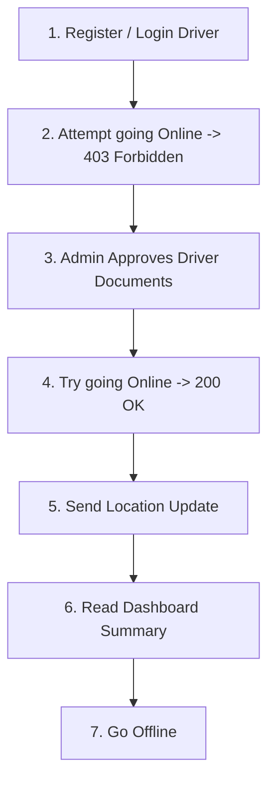
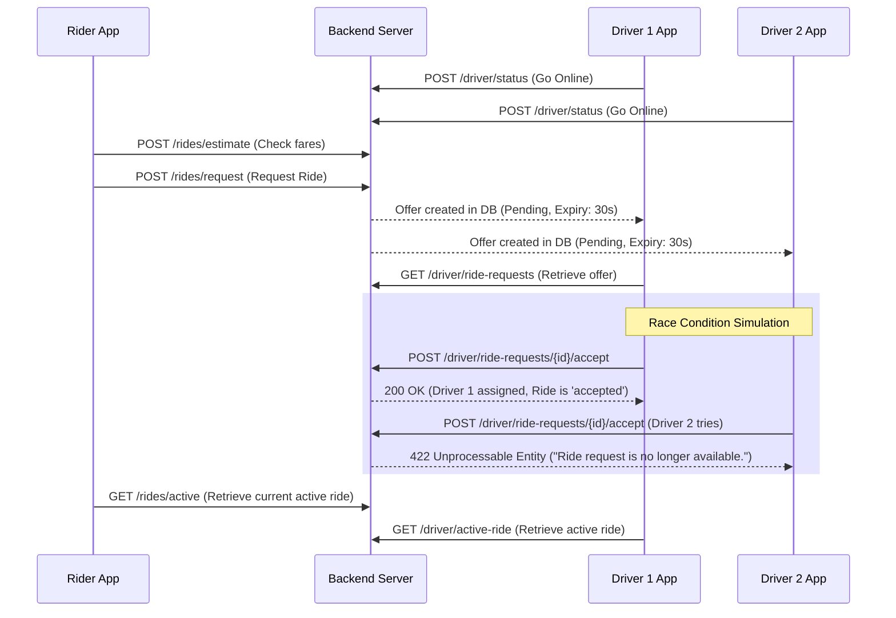
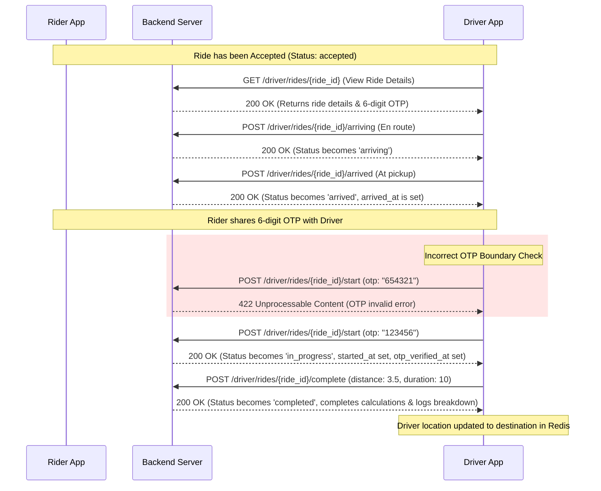
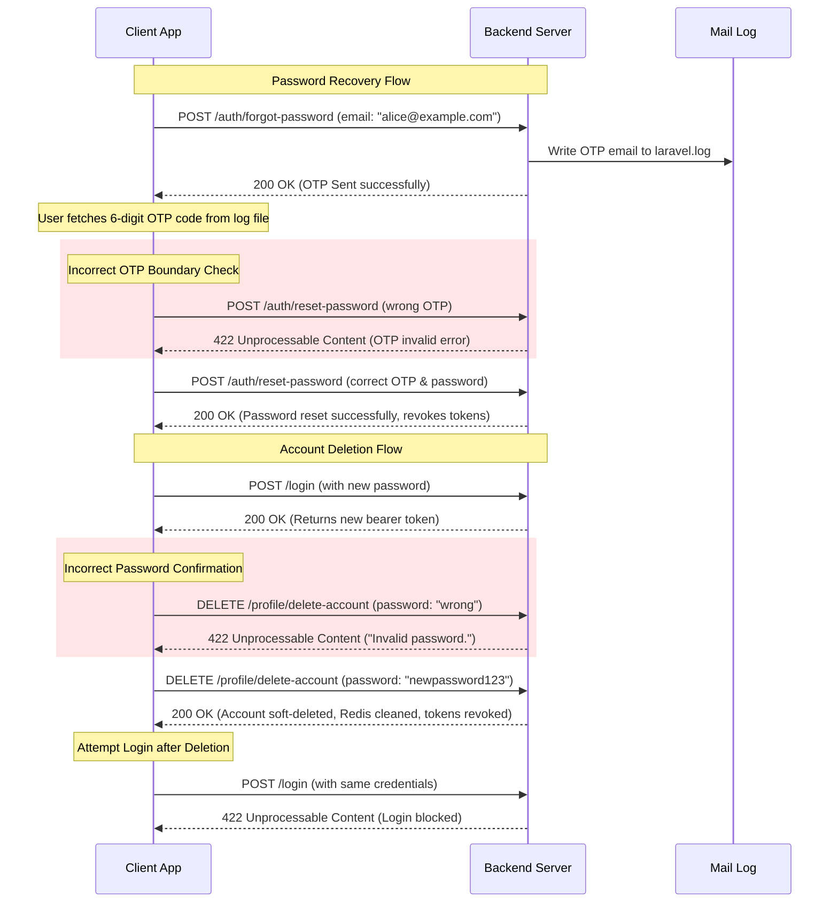

# UEY Premium Mobility - Postman Testing Guide
### Phase 4: Driver Availability & Live Location Testing Flow

This guide describes how to verify the **Driver Availability and Live Location** API endpoints in Postman.

---

## 1. Environment Setup
Configure your Postman environment with the following variables:
*   `base_url`: `http://uey.test/api/v1` (or local port URL e.g. `http://localhost:8000/api/v1`)
*   `driver_token`: The Bearer token received after driver registration or login.
*   `admin_token`: The Bearer token received after admin login.

---

## 2. API Endpoints Reference

### 1. Toggle Driver Availability Status
*   **Method / Route:** `POST {{base_url}}/driver/status`
*   **Headers:**
    *   `Accept: application/json`
    *   `Content-Type: application/json`
    *   `Authorization: Bearer {{driver_token}}`
*   **Body (JSON):**
    ```json
    {
      "is_online": true
    }
    ```
*   **Expected Response (200 OK):**
    ```json
    {
      "success": true,
      "message": "Driver status updated successfully.",
      "is_online": true
    }
    ```

### 2. Update Live Location Coordinates
*   **Method / Route:** `POST {{base_url}}/driver/location`
*   **Headers:**
    *   `Accept: application/json`
    *   `Content-Type: application/json`
    *   `Authorization: Bearer {{driver_token}}`
*   **Body (JSON):**
    ```json
    {
      "current_latitude": 51.5204,
      "current_longitude": -0.1482,
      "bearing": 120.5
    }
    ```
*   **Expected Response (200 OK):**
    ```json
    {
      "success": true,
      "message": "Driver location updated successfully."
    }
    ```

### 3. Get Driver Dashboard Details
*   **Method / Route:** `GET {{base_url}}/driver/dashboard`
*   **Headers:**
    *   `Accept: application/json`
    *   `Authorization: Bearer {{driver_token}}`
*   **Expected Response (200 OK):**
    ```json
    {
      "success": true,
      "dashboard": {
        "driver_profile_id": 1,
        "is_online": true,
        "rating": 5.0,
        "acceptance_rate": 100.0,
        "ontime_rate": 100.0,
        "completed_rides_count": 0,
        "earnings_summary": {
          "today": 0.0,
          "this_week": 0.0,
          "total": 0.0
        },
        "profile": {
          "name": "Bob Driver",
          "email": "bob.driver@example.com",
          "phone": "+447911999999",
          "avatar_url": null
        },
        "last_seen_at": "2026-06-23T19:12:00+00:00"
      }
    }
    ```

---

## 3. Recommended Testing Sequence (Step-by-Step)

Follow this order to test the full module including validation boundary checks:



### Step 1: Register and Login Driver
1.  Call `POST {{base_url}}/register/driver` with Bob's details.
2.  Store the returned token in `driver_token`. At this point, Bob's user status is `pending_approval`.

### Step 2: Test Validation (Go Online fails when unapproved)
1.  Make a `POST {{base_url}}/driver/status` request with `is_online: true` using `driver_token`.
2.  Verify the server rejects the request with a **403 Forbidden** status:
    *   *Payload:* `{"success":false,"message":"Only active approved drivers can go online."}`

### Step 3: Approve Driver via Admin
*(If running locally, you can approve Bob's documents via DB updates or by simulating the admin approvals:)*
1.  Login as admin (`POST {{base_url}}/login` with admin credentials) and save token to `admin_token`.
2.  Get Bob's pending documents via `GET {{base_url}}/admin/documents/pending`.
3.  For each required document ID (driving license, vehicle registration, and insurance), call `POST {{base_url}}/admin/documents/{id}/verify` with `status: "approved"`.
4.  Confirm Bob's status becomes `active` once the last document is approved.

### Step 4: Toggle Status Online
1.  Retry `POST {{base_url}}/driver/status` with `is_online: true` using `driver_token`.
2.  Verify the response returns **200 OK** and shows `"is_online": true`.
3.  *(Behind the scenes, this stores Bob's coordinates in the Redis GEO index `drivers:locations`)*.

### Step 5: Send Live Location Updates
1.  Make a `POST {{base_url}}/driver/location` request using `driver_token` with new latitude and longitude values (e.g. `51.5210`, `-0.1490`).
2.  Verify the response returns **200 OK**.
3.  *(Behind the scenes, Bob's coordinates are immediately synced in the Redis GEO index)*.

### Step 6: View Driver Dashboard
1.  Perform a `GET {{base_url}}/driver/dashboard` request using `driver_token`.
2.  Verify that `is_online` is `true` and that `rating`, `acceptance_rate`, and `ontime_rate` are returned correctly alongside his user profile summary.

### Step 7: Go Offline
1.  Trigger `POST {{base_url}}/driver/status` with `is_online: false`.
2.  Verify that `is_online` in the response is now `false`.
3.  *(Behind the scenes, Bob's record is removed from the Redis GEO index `drivers:locations`)*.

---

## 4. Phase 5: Ride Booking & Matching Engine Reference

### 1. Estimate Fare (Rider)
*   **Method / Route:** `POST {{base_url}}/rides/estimate`
*   **Headers:**
    *   `Accept: application/json`
    *   `Content-Type: application/json`
    *   `Authorization: Bearer {{rider_token}}`
*   **Body (JSON):**
    ```json
    {
      "pickup_latitude": 51.5074,
      "pickup_longitude": -0.1278,
      "destination_latitude": 51.5204,
      "destination_longitude": -0.1482
    }
    ```
*   **Expected Response (200 OK):**
    ```json
    {
      "success": true,
      "estimates": [
        {
          "vehicle_type_id": 1,
          "name": "Standard",
          "capacity": 4,
          "estimated_distance": 1.99,
          "estimated_duration": 3,
          "estimated_fare": 9.48
        }
      ]
    }
    ```

### 2. Request Ride (Rider)
*   **Method / Route:** `POST {{base_url}}/rides/request`
*   **Headers:**
    *   `Accept: application/json`
    *   `Content-Type: application/json`
    *   `Authorization: Bearer {{rider_token}}`
*   **Body (JSON):**
    ```json
    {
      "pickup_latitude": 51.5074,
      "pickup_longitude": -0.1278,
      "pickup_address": "London Eye, London",
      "destination_latitude": 51.5204,
      "destination_longitude": -0.1482,
      "destination_address": "Regent's Park, London",
      "vehicle_type_id": 1
    }
    ```
*   **Expected Response (201 Created):**
    ```json
    {
      "success": true,
      "message": "Ride requested successfully.",
      "ride": {
        "id": 1,
        "rider_id": 10,
        "driver_profile_id": null,
        "vehicle_type_id": 1,
        "pickup_address": "London Eye, London",
        "pickup_latitude": 51.5074,
        "pickup_longitude": -0.1278,
        "destination_address": "Regent's Park, London",
        "destination_latitude": 51.5204,
        "destination_longitude": -0.1482,
        "status": "pending",
        "otp": "483920",
        "estimated_distance": 1.99,
        "estimated_duration": 3,
        "estimated_fare": 9.48,
        "created_at": "2026-06-24T01:45:00+00:00",
        "updated_at": "2026-06-24T01:45:00+00:00"
      }
    }
    ```

### 3. Cancel Ride (Rider)
*   **Method / Route:** `POST {{base_url}}/rides/{ride_id}/cancel`
*   **Headers:**
    *   `Accept: application/json`
    *   `Content-Type: application/json`
    *   `Authorization: Bearer {{rider_token}}`
*   **Body (JSON - Optional):**
    ```json
    {
      "cancel_reason": "Rider decided to walk"
    }
    ```
*   **Expected Response (200 OK):**
    ```json
    {
      "success": true,
      "message": "Ride cancelled successfully.",
      "ride": {
        "id": 1,
        "status": "cancelled",
        "cancelled_by": "rider",
        "cancel_reason": "Rider decided to walk",
        "cancelled_at": "2026-06-24T01:47:00+00:00"
      }
    }
    ```

### 4. Fetch Active Ride (Rider)
*   **Method / Route:** `GET {{base_url}}/rides/active`
*   **Headers:**
    *   `Accept: application/json`
    *   `Authorization: Bearer {{rider_token}}`
*   **Expected Response (200 OK):**
    ```json
    {
      "success": true,
      "ride": {
        "id": 1,
        "status": "accepted",
        "driver_profile_id": 3
      }
    }
    ```

### 5. Fetch Ride History (Rider)
*   **Method / Route:** `GET {{base_url}}/rides`
*   **Headers:**
    *   `Accept: application/json`
    *   `Authorization: Bearer {{rider_token}}`
*   **Expected Response (200 OK):**
    ```json
    {
      "success": true,
      "rides": [
        {
          "id": 1,
          "status": "cancelled"
        }
      ]
    }
    ```

### 6. Get Pending Ride Requests (Driver)
*   **Method / Route:** `GET {{base_url}}/driver/ride-requests`
*   **Headers:**
    *   `Accept: application/json`
    *   `Authorization: Bearer {{driver_token}}`
*   **Expected Response (200 OK):**
    ```json
    {
      "success": true,
      "requests": [
        {
          "id": 5,
          "ride_id": 2,
          "driver_profile_id": 3,
          "status": "pending",
          "expires_at": "2026-06-24T01:45:30+00:00"
        }
      ]
    }
    ```

### 7. Accept Ride Request (Driver)
*   **Method / Route:** `POST {{base_url}}/driver/ride-requests/{request_id}/accept`
*   **Headers:**
    *   `Accept: application/json`
    *   `Authorization: Bearer {{driver_token}}`
*   **Expected Response (200 OK):**
    ```json
    {
      "success": true,
      "message": "Ride request accepted successfully.",
      "ride": {
        "id": 2,
        "status": "accepted",
        "driver_profile_id": 3,
        "accepted_at": "2026-06-24T01:45:10+00:00"
      }
    }
    ```

### 8. Decline Ride Request (Driver)
*   **Method / Route:** `POST {{base_url}}/driver/ride-requests/{request_id}/decline`
*   **Headers:**
    *   `Accept: application/json`
    *   `Authorization: Bearer {{driver_token}}`
*   **Expected Response (200 OK):**
    ```json
    {
      "success": true,
      "message": "Ride request declined successfully."
    }
    ```

### 9. Get Driver Active Ride (Driver)
*   **Method / Route:** `GET {{base_url}}/driver/active-ride`
*   **Headers:**
    *   `Accept: application/json`
    *   `Authorization: Bearer {{driver_token}}`
*   **Expected Response (200 OK):**
    ```json
    {
      "success": true,
      "ride": {
        "id": 2,
        "status": "accepted",
        "driver_profile_id": 3
      }
    }
    ```

---

## 5. End-to-End Ride Matching Testing Scenario (Step-by-Step)

Follow this order in Postman to test booking, expiration, matching, and concurrent acceptance race condition protection:



### Step 1: Pre-requisites & Setup
1. Authenticate two drivers (approved and online) and store their tokens in `driver1_token` and `driver2_token`.
2. Authenticate a rider and store the token in `rider_token`.

### Step 2: Fare Estimation
1. Call `POST {{base_url}}/rides/estimate` using `rider_token`.
2. Verify you get fare, distance, and duration breakdowns for active categories (e.g. Standard, SUV).

### Step 3: Request Ride
1. Call `POST {{base_url}}/rides/request` with standard coordinates using `rider_token`.
2. Save the returned `ride.id` and note the `otp` is 6 digits.

### Step 4: Driver Fetches Offers
1. Call `GET {{base_url}}/driver/ride-requests` using `driver1_token`. You should see the pending offer.
2. Call `GET {{base_url}}/driver/ride-requests` using `driver2_token`. You should see the same pending offer.

### Step 5: Test Expiration (Optional Boundary Check)
1. Wait 30 seconds without making any decision.
2. Re-call `GET {{base_url}}/driver/ride-requests` for both drivers.
3. Verify that the offer list is empty. Check your database `ride_requests` table to verify the status transitioned to `expired`.

### Step 6: Test Race Condition & DB Locking
1. Request another ride using the rider token to create a fresh trip offer.
2. Using `driver1_token`, call `POST {{base_url}}/driver/ride-requests/{request_id}/accept`.
3. You should receive **200 OK** and the ride status should become `accepted`.
4. Immediately after, call `POST {{base_url}}/driver/ride-requests/{request_id}/accept` using `driver2_token` (pointing to Driver 2's request ID for the same ride).
5. Verify that Driver 2 receives a **422 Unprocessable Entity** response with message `"Ride request is no longer available."`.

### Step 7: Retrieve Active Rides
1. Call `GET {{base_url}}/rides/active` using `rider_token` and verify it return the accepted ride.
2. Call `GET {{base_url}}/driver/active-ride` using `driver1_token` and verify it returns the same ride.
3. Call `GET {{base_url}}/driver/active-ride` using `driver2_token` and verify it returns **404 Not Found** (since Driver 2 was not assigned).

---

## 6. Phase 6: Ride Lifecycle Management & Trip Execution Reference

### 1. Retrieve Ride Details (Driver)
*   **Method / Route:** `GET {{base_url}}/driver/rides/{ride_id}`
*   **Headers:**
    *   `Accept: application/json`
    *   `Authorization: Bearer {{driver_token}}`
*   **Expected Response (200 OK):**
    ```json
    {
      "success": true,
      "ride": {
        "id": 2,
        "rider_id": 1,
        "driver_profile_id": 3,
        "vehicle_type_id": 1,
        "pickup_address": "London Eye",
        "pickup_latitude": 51.5074,
        "pickup_longitude": -0.1278,
        "destination_address": "Regent Park",
        "destination_latitude": 51.5204,
        "destination_longitude": -0.1482,
        "status": "accepted",
        "otp": "123456",
        "estimated_distance": 2.0,
        "estimated_duration": 5,
        "estimated_fare": 10.0,
        "actual_distance": null,
        "actual_duration": null,
        "actual_fare": null,
        "accepted_at": "2026-06-26T13:19:32+05:30",
        "arrived_at": null,
        "started_at": null,
        "completed_at": null,
        "cancelled_at": null
      }
    }
    ```

### 2. Mark Ride as Arriving (Driver)
*   **Method / Route:** `POST {{base_url}}/driver/rides/{ride_id}/arriving`
*   **Headers:**
    *   `Accept: application/json`
    *   `Authorization: Bearer {{driver_token}}`
*   **Expected Response (200 OK):**
    ```json
    {
      "success": true,
      "message": "Ride status updated to arriving.",
      "ride": {
        "id": 2,
        "status": "arriving"
      }
    }
    ```

### 3. Mark Ride as Arrived (Driver)
*   **Method / Route:** `POST {{base_url}}/driver/rides/{ride_id}/arrived`
*   **Headers:**
    *   `Accept: application/json`
    *   `Authorization: Bearer {{driver_token}}`
*   **Expected Response (200 OK):**
    ```json
    {
      "success": true,
      "message": "Ride status updated to arrived.",
      "ride": {
        "id": 2,
        "status": "arrived",
        "arrived_at": "2026-06-26T13:22:00+05:30"
      }
    }
    ```

### 4. Start Ride (Driver)
*   **Method / Route:** `POST {{base_url}}/driver/rides/{ride_id}/start`
*   **Headers:**
    *   `Accept: application/json`
    *   `Content-Type: application/json`
    *   `Authorization: Bearer {{driver_token}}`
*   **Body (JSON):**
    ```json
    {
      "otp": "123456"
    }
    ```
*   **Expected Response (200 OK):**
    ```json
    {
      "success": true,
      "message": "Ride started successfully.",
      "ride": {
        "id": 2,
        "status": "in_progress",
        "started_at": "2026-06-26T13:24:00+05:30",
        "otp_verified_at": "2026-06-26T13:24:00+05:30",
        "otp_verified_by": 3
      }
    }
    ```

### 5. Complete Ride (Driver)
*   **Method / Route:** `POST {{base_url}}/driver/rides/{ride_id}/complete`
*   **Headers:**
    *   `Accept: application/json`
    *   `Content-Type: application/json`
    *   `Authorization: Bearer {{driver_token}}`
*   **Body (JSON):**
    ```json
    {
      "actual_distance": 3.5,
      "actual_duration": 10
    }
    ```
*   **Expected Response (200 OK):**
    ```json
    {
      "success": true,
      "message": "Ride completed successfully.",
      "ride": {
        "id": 2,
        "status": "completed",
        "actual_distance": 3.5,
        "actual_duration": 10,
        "actual_fare": 15.25,
        "completed_at": "2026-06-26T13:34:00+05:30",
        "fare_breakdown": {
          "base_fare": 5.00,
          "distance": 3.5,
          "per_km_rate": 1.50,
          "distance_fare": 5.25,
          "duration": 10,
          "per_minute_rate": 0.50,
          "duration_fare": 5.00,
          "calculated_fare": 15.25,
          "minimum_fare": 7.00,
          "applied_minimum_fare": false,
          "final_fare": 15.25
        }
      }
    }
    ```

---

## 7. End-to-End Trip Execution Testing Flow (Step-by-Step)

Follow this sequence to test a complete ride trip execution from start to finish:



### Step 1: Start from an Accepted Ride
1. Ensure you have an active ride with status `accepted` (e.g. following Step 6 of the matching flow).

### Step 2: Fetch Ride Details
1. Call `GET {{base_url}}/driver/rides/{ride_id}` using `driver_token`.
2. Verify you get the ride details, and note the `otp` value.

### Step 3: Transition to Arriving
1. Call `POST {{base_url}}/driver/rides/{ride_id}/arriving` using `driver_token`.
2. Verify response status is **200 OK** and status transitions to `arriving`.
3. Try calling `/start` or `/complete` at this stage, verify it fails with **422 Unprocessable Content** (state sequence validation).

### Step 4: Transition to Arrived
1. Call `POST {{base_url}}/driver/rides/{ride_id}/arrived` using `driver_token`.
2. Verify response status is **200 OK**, status transitions to `arrived`, and `arrived_at` timestamp is populated.

### Step 5: Start the Ride with OTP Verification
1. Attempt `POST {{base_url}}/driver/rides/{ride_id}/start` with an incorrect 6-digit OTP. Verify it returns **422 Validation Error**.
2. Call `POST {{base_url}}/driver/rides/{ride_id}/start` with the correct OTP retrieved in Step 2.
3. Verify it returns **200 OK**, status transitions to `in_progress`, and `otp_verified_at`, `otp_verified_by` and `started_at` are populated.

### Step 6: Complete the Ride & Fare Calculation
1. Call `POST {{base_url}}/driver/rides/{ride_id}/complete` using `driver_token` with `actual_distance` and `actual_duration` parameters.
2. Verify it returns **200 OK**, status transitions to `completed`, and `completed_at` is set.
3. Check the `actual_fare` and verify the math conforms to standard/category pricing formulas.
4. Check the `fare_breakdown` JSON matches the calculated values.
5. Verify in DB/Redis that the driver's location is automatically updated to the ride's destination coordinates.

---

## 8. Phase 6.5: Forgot Password & User Account Deletion Reference

### 1. Request Password Reset OTP
*   **Method / Route:** `POST {{base_url}}/auth/forgot-password`
*   **Headers:**
    *   `Accept: application/json`
    *   `Content-Type: application/json`
*   **Body (JSON):**
    ```json
    {
      "email": "alice@example.com"
    }
    ```
*   **Expected Response (200 OK):**
    ```json
    {
      "success": true,
      "message": "Password reset OTP sent successfully."
    }
    ```

### 2. Verify OTP & Reset Password
*   **Method / Route:** `POST {{base_url}}/auth/reset-password`
*   **Headers:**
    *   `Accept: application/json`
    *   `Content-Type: application/json`
*   **Body (JSON):**
    ```json
    {
      "email": "alice@example.com",
      "otp": "123456",
      "password": "newpassword123",
      "password_confirmation": "newpassword123"
    }
    ```
*   **Expected Response (200 OK):**
    ```json
    {
      "success": true,
      "message": "Password reset successfully."
    }
    ```

### 3. Delete Account
*   **Method / Route:** `DELETE {{base_url}}/profile/delete-account`
*   **Headers:**
    *   `Accept: application/json`
    *   `Authorization: Bearer {{auth_token}}`
*   **Body (JSON):**
    ```json
    {
      "password": "newpassword123"
    }
    ```
*   **Expected Response (200 OK):**
    ```json
    {
      "success": true,
      "message": "Account deleted successfully."
    }
    ```
*   **Expected Response (422 Unprocessable Content - Incorrect Password):**
    ```json
    {
      "success": false,
      "message": "Invalid password."
    }
    ```

---

## 9. End-to-End Account Management Testing Flow

Follow this sequence to test password recovery and profile deletion:



### Step 1: Request Recovery OTP
1. Call `POST {{base_url}}/auth/forgot-password` with your registered email (e.g. `alice@example.com`).
2. Verify you receive a **200 OK** response.
3. Open `storage/logs/laravel.log` and find the latest mail notification containing your 6-digit OTP code (e.g., `123456`).

### Step 2: Test Verification Expiry & Validation
1. Send `POST {{base_url}}/auth/reset-password` with an incorrect OTP. Confirm it returns a **422 Validation Error**.
2. Send `POST {{base_url}}/auth/reset-password` with the correct OTP and a password shorter than 8 characters. Confirm it fails with validation rules.

### Step 3: Complete Reset Password
1. Call `POST {{base_url}}/auth/reset-password` with the correct OTP, email, and matching password (e.g. `newpassword123`).
2. Verify you get **200 OK** and password is reset.
3. Try calling an authenticated profile route using any old bearer token. Verify it returns **401 Unauthorized** (confirming token revocation).

### Step 4: Login with New Password
1. Call `POST {{base_url}}/login` with your phone number and your new password `newpassword123`.
2. Save the returned bearer token to your environments `auth_token` variable.

### Step 5: Test Delete Account Password Validation
1. Call `DELETE {{base_url}}/profile/delete-account` using the new token and password `wrongpassword`.
2. Confirm the response status is **422 Unprocessable Content** and matches:
   ```json
   {
     "success": false,
     "message": "Invalid password."
   }
   ```

### Step 6: Complete Account Deletion
1. Call `DELETE {{base_url}}/profile/delete-account` with the correct password `newpassword123`.
2. Confirm response returns **200 OK** and `"Account deleted successfully."`.
3. Try calling `/profile` using that token. Confirm it returns **401 Unauthorized** (revoked).
4. Try logging in again via `/login`. Confirm it fails with a **422 Validation Error** (user is soft-deleted and cannot be found).

