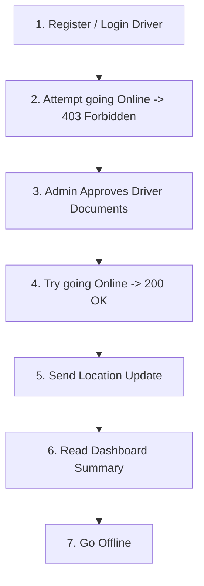
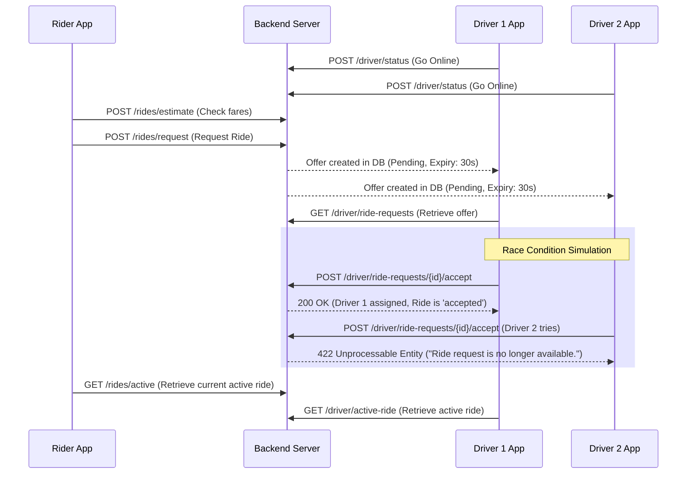
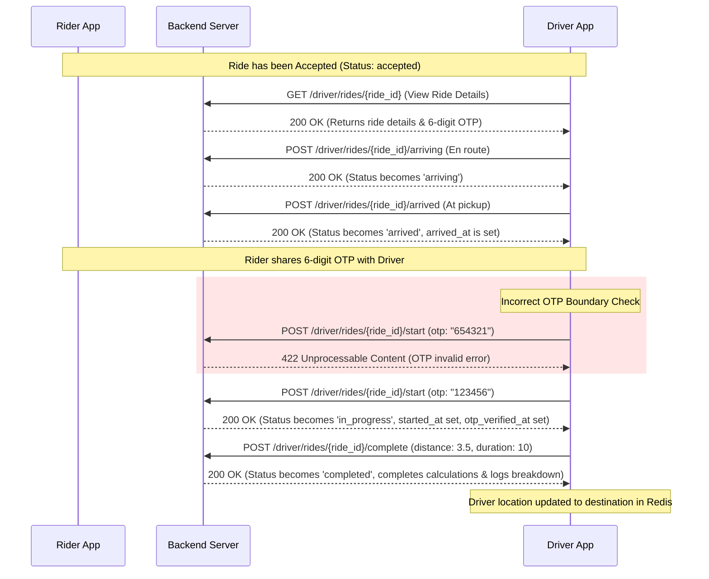
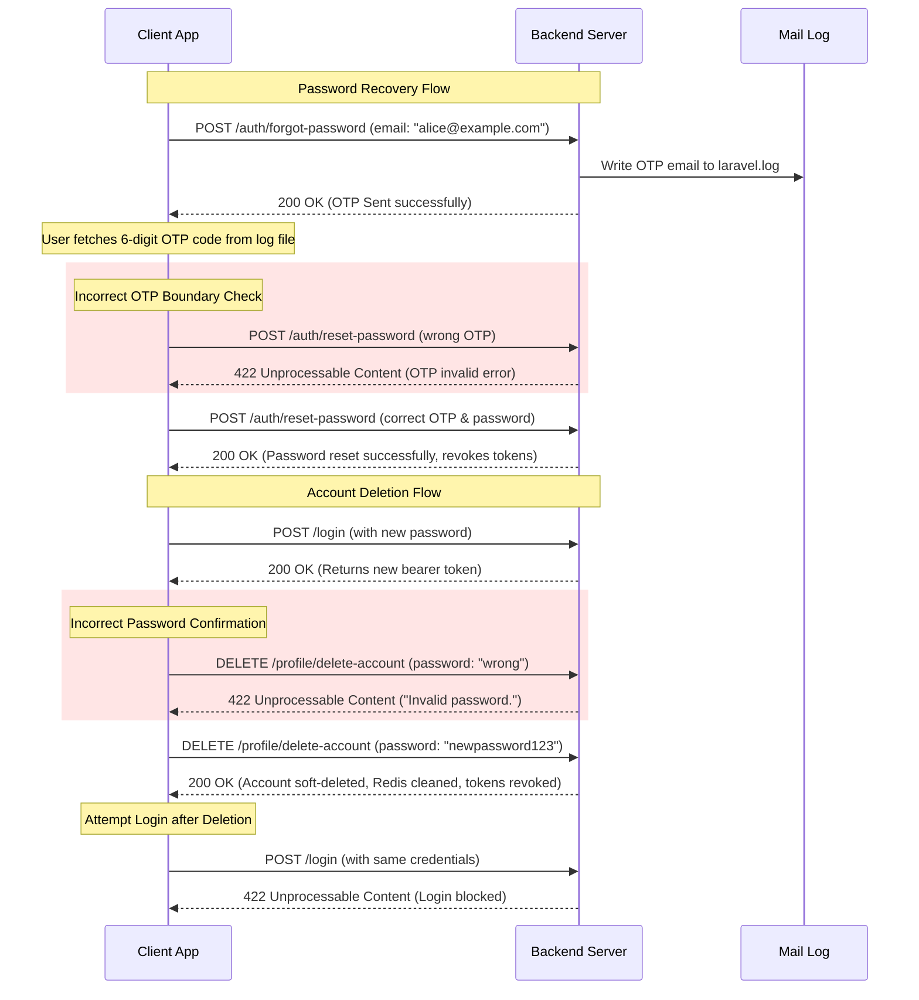
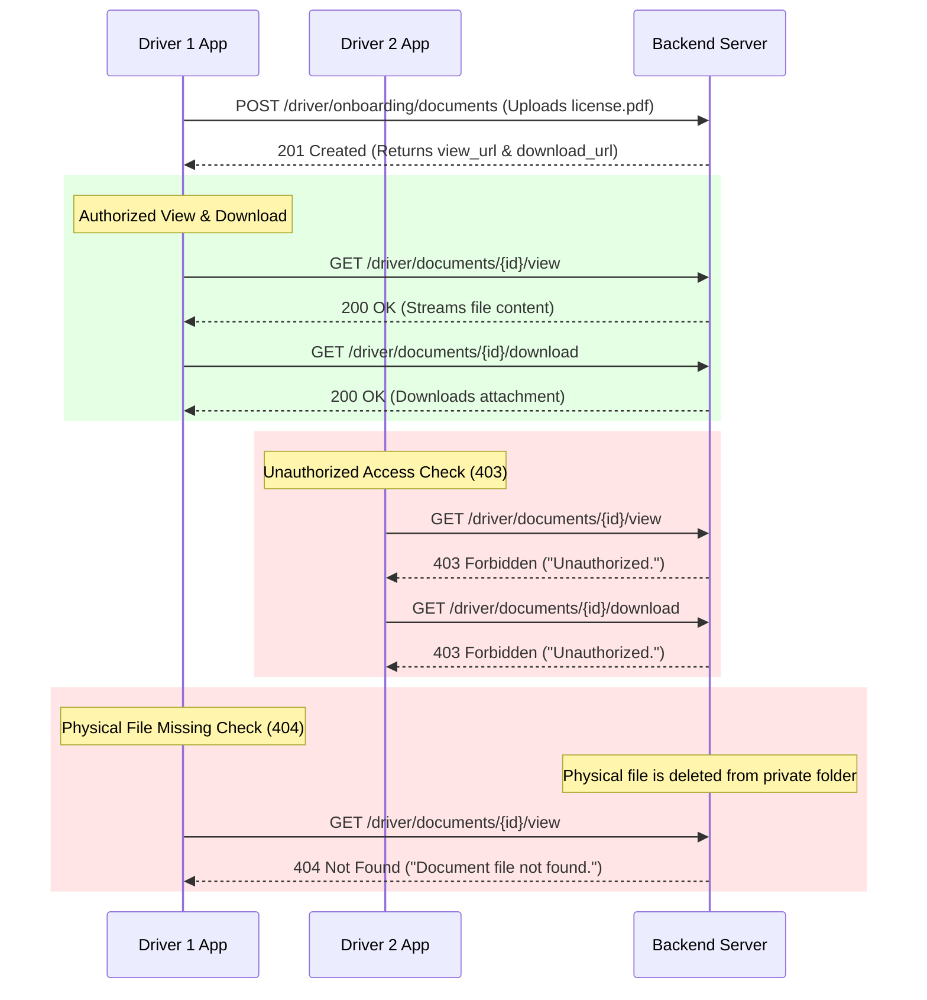
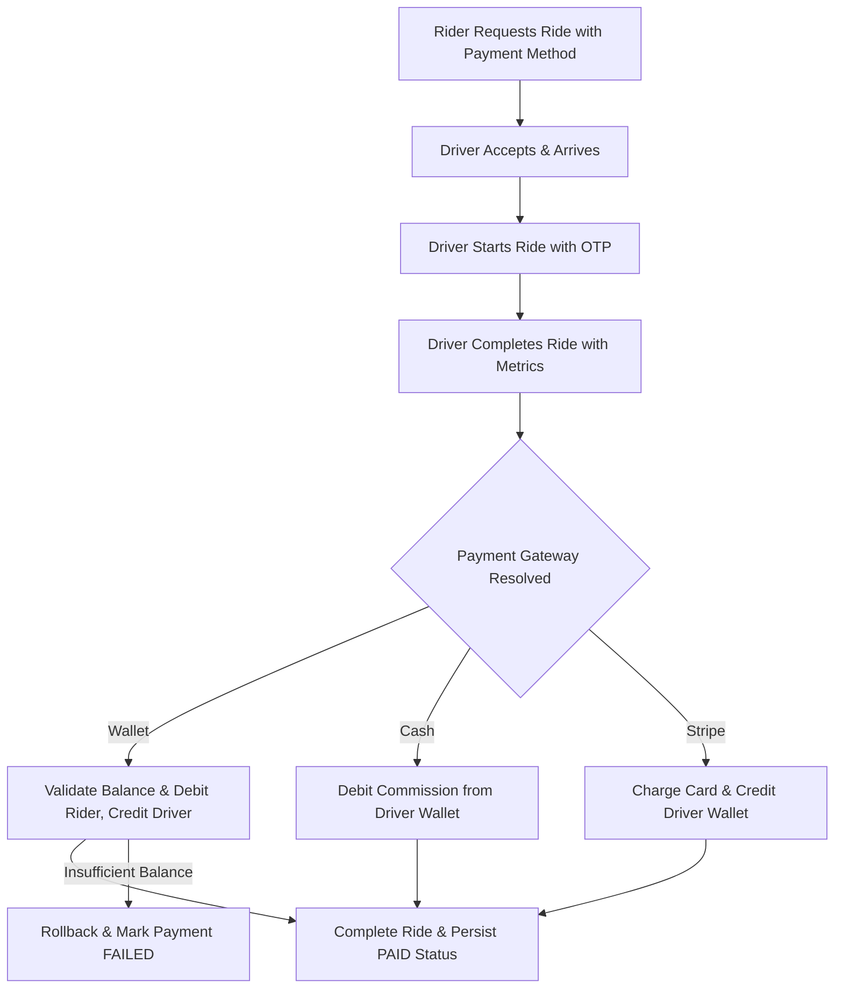

# UEY Premium Mobility - Postman Testing Guide
### Phase 4: Driver Availability & Live Location Testing Flow

This guide describes how to verify the **Driver Availability and Live Location** API endpoints in Postman.

---

## 1. Environment Setup
Configure your Postman environment with the following variables:
*   `base_url`: `http://uey.test/api/v1` (or local port URL e.g. `http://localhost:8000/api/v1`)
*   `driver_token`: The Bearer token received after driver registration or login.
*   `admin_token`: The Bearer token received after admin login.

---

## 2. API Endpoints Reference

### 1. Toggle Driver Availability Status
*   **Method / Route:** `POST {{base_url}}/driver/status`
*   **Headers:**
    *   `Accept: application/json`
    *   `Content-Type: application/json`
    *   `Authorization: Bearer {{driver_token}}`
*   **Body (JSON):**
    ```json
    {
      "is_online": true
    }
    ```
*   **Expected Response (200 OK):**
    ```json
    {
      "success": true,
      "message": "Driver status updated successfully.",
      "is_online": true
    }
    ```

### 2. Update Live Location Coordinates
*   **Method / Route:** `POST {{base_url}}/driver/location`
*   **Headers:**
    *   `Accept: application/json`
    *   `Content-Type: application/json`
    *   `Authorization: Bearer {{driver_token}}`
*   **Body (JSON):**
    ```json
    {
      "current_latitude": 51.5204,
      "current_longitude": -0.1482,
      "bearing": 120.5
    }
    ```
*   **Expected Response (200 OK):**
    ```json
    {
      "success": true,
      "message": "Driver location updated successfully."
    }
    ```

### 3. Get Driver Dashboard Details
*   **Method / Route:** `GET {{base_url}}/driver/dashboard`
*   **Headers:**
    *   `Accept: application/json`
    *   `Authorization: Bearer {{driver_token}}`
*   **Expected Response (200 OK):**
    ```json
    {
      "success": true,
      "dashboard": {
        "driver_profile_id": 1,
        "is_online": true,
        "rating": 5.0,
        "acceptance_rate": 100.0,
        "ontime_rate": 100.0,
        "completed_rides_count": 0,
        "earnings_summary": {
          "today": 0.0,
          "this_week": 0.0,
          "total": 0.0
        },
        "profile": {
          "name": "Bob Driver",
          "email": "bob.driver@example.com",
          "phone": "+447911999999",
          "avatar_url": null
        },
        "last_seen_at": "2026-06-23T19:12:00+00:00"
      }
    }
    ```

---

## 3. Recommended Testing Sequence (Step-by-Step)

Follow this order to test the full module including validation boundary checks:


```mermaid
graph TD
    A[1. Register / Login Driver] --> B[2. Attempt going Online -> 403 Forbidden]
    B --> C[3. Admin Approves Driver Documents]
    C --> D[4. Try going Online -> 200 OK]
    D --> E[5. Send Location Update]
    E --> F[6. Read Dashboard Summary]
    F --> G[7. Go Offline]
```

### Step 1: Register and Login Driver
1.  Call `POST {{base_url}}/register/driver` with Bob's details.
2.  Store the returned token in `driver_token`. At this point, Bob's user status is `pending_approval`.

### Step 2: Test Validation (Go Online fails when unapproved)
1.  Make a `POST {{base_url}}/driver/status` request with `is_online: true` using `driver_token`.
2.  Verify the server rejects the request with a **403 Forbidden** status:
    *   *Payload:* `{"success":false,"message":"Only active approved drivers can go online."}`

### Step 3: Approve Driver via Admin
*(If running locally, you can approve Bob's documents via DB updates or by simulating the admin approvals:)*
1.  Login as admin (`POST {{base_url}}/login` with admin credentials) and save token to `admin_token`.
2.  Get Bob's pending documents via `GET {{base_url}}/admin/documents/pending`.
3.  For each required document ID (driving license, vehicle registration, and insurance), call `POST {{base_url}}/admin/documents/{id}/verify` with `status: "approved"`.
4.  Confirm Bob's status becomes `active` once the last document is approved.

### Step 4: Toggle Status Online
1.  Retry `POST {{base_url}}/driver/status` with `is_online: true` using `driver_token`.
2.  Verify the response returns **200 OK** and shows `"is_online": true`.
3.  *(Behind the scenes, this stores Bob's coordinates in the Redis GEO index `drivers:locations`)*.

### Step 5: Send Live Location Updates
1.  Make a `POST {{base_url}}/driver/location` request using `driver_token` with new latitude and longitude values (e.g. `51.5210`, `-0.1490`).
2.  Verify the response returns **200 OK**.
3.  *(Behind the scenes, Bob's coordinates are immediately synced in the Redis GEO index)*.

### Step 6: View Driver Dashboard
1.  Perform a `GET {{base_url}}/driver/dashboard` request using `driver_token`.
2.  Verify that `is_online` is `true` and that `rating`, `acceptance_rate`, and `ontime_rate` are returned correctly alongside his user profile summary.

### Step 7: Go Offline
1.  Trigger `POST {{base_url}}/driver/status` with `is_online: false`.
2.  Verify that `is_online` in the response is now `false`.
3.  *(Behind the scenes, Bob's record is removed from the Redis GEO index `drivers:locations`)*.

---

## 4. Phase 5: Ride Booking & Matching Engine Reference

### 1. Estimate Fare (Rider)
*   **Method / Route:** `POST {{base_url}}/rides/estimate`
*   **Headers:**
    *   `Accept: application/json`
    *   `Content-Type: application/json`
    *   `Authorization: Bearer {{rider_token}}`
*   **Body (JSON):**
    ```json
    {
      "pickup_latitude": 51.5074,
      "pickup_longitude": -0.1278,
      "destination_latitude": 51.5204,
      "destination_longitude": -0.1482
    }
    ```
*   **Expected Response (200 OK):**
    ```json
    {
      "success": true,
      "estimates": [
        {
          "vehicle_type_id": 1,
          "name": "Standard",
          "capacity": 4,
          "estimated_distance": 1.99,
          "estimated_duration": 3,
          "estimated_fare": 9.48
        }
      ]
    }
    ```

### 2. Request Ride (Rider)
*   **Method / Route:** `POST {{base_url}}/rides/request`
*   **Headers:**
    *   `Accept: application/json`
    *   `Content-Type: application/json`
    *   `Authorization: Bearer {{rider_token}}`
*   **Body (JSON):**
    ```json
    {
      "pickup_latitude": 51.5074,
      "pickup_longitude": -0.1278,
      "pickup_address": "London Eye, London",
      "destination_latitude": 51.5204,
      "destination_longitude": -0.1482,
      "destination_address": "Regent's Park, London",
      "vehicle_type_id": 1
    }
    ```
*   **Expected Response (201 Created):**
    ```json
    {
      "success": true,
      "message": "Ride requested successfully.",
      "ride": {
        "id": 1,
        "rider_id": 10,
        "driver_profile_id": null,
        "vehicle_type_id": 1,
        "pickup_address": "London Eye, London",
        "pickup_latitude": 51.5074,
        "pickup_longitude": -0.1278,
        "destination_address": "Regent's Park, London",
        "destination_latitude": 51.5204,
        "destination_longitude": -0.1482,
        "status": "pending",
        "otp": "483920",
        "estimated_distance": 1.99,
        "estimated_duration": 3,
        "estimated_fare": 9.48,
        "created_at": "2026-06-24T01:45:00+00:00",
        "updated_at": "2026-06-24T01:45:00+00:00"
      }
    }
    ```

### 3. Cancel Ride (Rider)
*   **Method / Route:** `POST {{base_url}}/rides/{ride_id}/cancel`
*   **Headers:**
    *   `Accept: application/json`
    *   `Content-Type: application/json`
    *   `Authorization: Bearer {{rider_token}}`
*   **Body (JSON - Optional):**
    ```json
    {
      "cancel_reason": "Rider decided to walk"
    }
    ```
*   **Expected Response (200 OK):**
    ```json
    {
      "success": true,
      "message": "Ride cancelled successfully.",
      "ride": {
        "id": 1,
        "status": "cancelled",
        "cancelled_by": "rider",
        "cancel_reason": "Rider decided to walk",
        "cancelled_at": "2026-06-24T01:47:00+00:00"
      }
    }
    ```

### 4. Fetch Active Ride (Rider)
*   **Method / Route:** `GET {{base_url}}/rides/active`
*   **Headers:**
    *   `Accept: application/json`
    *   `Authorization: Bearer {{rider_token}}`
*   **Expected Response (200 OK):**
    ```json
    {
      "success": true,
      "ride": {
        "id": 1,
        "status": "accepted",
        "driver_profile_id": 3
      }
    }
    ```

### 5. Fetch Ride History (Rider)
*   **Method / Route:** `GET {{base_url}}/rides`
*   **Headers:**
    *   `Accept: application/json`
    *   `Authorization: Bearer {{rider_token}}`
*   **Expected Response (200 OK):**
    ```json
    {
      "success": true,
      "rides": [
        {
          "id": 1,
          "status": "cancelled"
        }
      ]
    }
    ```

### 6. Get Pending Ride Requests (Driver)
*   **Method / Route:** `GET {{base_url}}/driver/ride-requests`
*   **Headers:**
    *   `Accept: application/json`
    *   `Authorization: Bearer {{driver_token}}`
*   **Expected Response (200 OK):**
    ```json
    {
      "success": true,
      "requests": [
        {
          "id": 5,
          "ride_id": 2,
          "driver_profile_id": 3,
          "status": "pending",
          "expires_at": "2026-06-24T01:45:30+00:00"
        }
      ]
    }
    ```

### 7. Accept Ride Request (Driver)
*   **Method / Route:** `POST {{base_url}}/driver/ride-requests/{request_id}/accept`
*   **Headers:**
    *   `Accept: application/json`
    *   `Authorization: Bearer {{driver_token}}`
*   **Expected Response (200 OK):**
    ```json
    {
      "success": true,
      "message": "Ride request accepted successfully.",
      "ride": {
        "id": 2,
        "status": "accepted",
        "driver_profile_id": 3,
        "accepted_at": "2026-06-24T01:45:10+00:00"
      }
    }
    ```

### 8. Decline Ride Request (Driver)
*   **Method / Route:** `POST {{base_url}}/driver/ride-requests/{request_id}/decline`
*   **Headers:**
    *   `Accept: application/json`
    *   `Authorization: Bearer {{driver_token}}`
*   **Expected Response (200 OK):**
    ```json
    {
      "success": true,
      "message": "Ride request declined successfully."
    }
    ```

### 9. Get Driver Active Ride (Driver)
*   **Method / Route:** `GET {{base_url}}/driver/active-ride`
*   **Headers:**
    *   `Accept: application/json`
    *   `Authorization: Bearer {{driver_token}}`
*   **Expected Response (200 OK):**
    ```json
    {
      "success": true,
      "ride": {
        "id": 2,
        "status": "accepted",
        "driver_profile_id": 3
      }
    }
    ```

---

## 5. End-to-End Ride Matching Testing Scenario (Step-by-Step)

Follow this order in Postman to test booking, expiration, matching, and concurrent acceptance race condition protection:


```mermaid
sequenceDiagram
    participant Rider as Rider App
    participant Server as Backend Server
    participant Driver1 as Driver 1 App
    participant Driver2 as Driver 2 App

    Driver1->>Server: POST /driver/status (Go Online)
    Driver2->>Server: POST /driver/status (Go Online)
    Rider->>Server: POST /rides/estimate (Check fares)
    Rider->>Server: POST /rides/request (Request Ride)
    Server-->>Driver1: Offer created in DB (Pending, Expiry: 30s)
    Server-->>Driver2: Offer created in DB (Pending, Expiry: 30s)
    Driver1->>Server: GET /driver/ride-requests (Retrieve offer)
    
    rect rgba(0, 0, 255, .1)
        Note over Driver1, Driver2: Race Condition Simulation
        Driver1->>Server: POST /driver/ride-requests/{id}/accept
        Server-->>Driver1: 200 OK (Driver 1 assigned, Ride is 'accepted')
        Driver2->>Server: POST /driver/ride-requests/{id}/accept (Driver 2 tries)
        Server-->>Driver2: 422 Unprocessable Entity ("Ride request is no longer available.")
    end

    Rider->>Server: GET /rides/active (Retrieve current active ride)
    Driver1->>Server: GET /driver/active-ride (Retrieve active ride)
```

### Step 1: Pre-requisites & Setup
1. Authenticate two drivers (approved and online) and store their tokens in `driver1_token` and `driver2_token`.
2. Authenticate a rider and store the token in `rider_token`.

### Step 2: Fare Estimation
1. Call `POST {{base_url}}/rides/estimate` using `rider_token`.
2. Verify you get fare, distance, and duration breakdowns for active categories (e.g. Standard, SUV).

### Step 3: Request Ride
1. Call `POST {{base_url}}/rides/request` with standard coordinates using `rider_token`.
2. Save the returned `ride.id` and note the `otp` is 6 digits.

### Step 4: Driver Fetches Offers
1. Call `GET {{base_url}}/driver/ride-requests` using `driver1_token`. You should see the pending offer.
2. Call `GET {{base_url}}/driver/ride-requests` using `driver2_token`. You should see the same pending offer.

### Step 5: Test Expiration (Optional Boundary Check)
1. Wait 30 seconds without making any decision.
2. Re-call `GET {{base_url}}/driver/ride-requests` for both drivers.
3. Verify that the offer list is empty. Check your database `ride_requests` table to verify the status transitioned to `expired`.

### Step 6: Test Race Condition & DB Locking
1. Request another ride using the rider token to create a fresh trip offer.
2. Using `driver1_token`, call `POST {{base_url}}/driver/ride-requests/{request_id}/accept`.
3. You should receive **200 OK** and the ride status should become `accepted`.
4. Immediately after, call `POST {{base_url}}/driver/ride-requests/{request_id}/accept` using `driver2_token` (pointing to Driver 2's request ID for the same ride).
5. Verify that Driver 2 receives a **422 Unprocessable Entity** response with message `"Ride request is no longer available."`.

### Step 7: Retrieve Active Rides
1. Call `GET {{base_url}}/rides/active` using `rider_token` and verify it return the accepted ride.
2. Call `GET {{base_url}}/driver/active-ride` using `driver1_token` and verify it returns the same ride.
3. Call `GET {{base_url}}/driver/active-ride` using `driver2_token` and verify it returns **404 Not Found** (since Driver 2 was not assigned).

---

## 6. Phase 6: Ride Lifecycle Management & Trip Execution Reference

### 1. Retrieve Ride Details (Driver)
*   **Method / Route:** `GET {{base_url}}/driver/rides/{ride_id}`
*   **Headers:**
    *   `Accept: application/json`
    *   `Authorization: Bearer {{driver_token}}`
*   **Expected Response (200 OK):**
    ```json
    {
      "success": true,
      "ride": {
        "id": 2,
        "rider_id": 1,
        "driver_profile_id": 3,
        "vehicle_type_id": 1,
        "pickup_address": "London Eye",
        "pickup_latitude": 51.5074,
        "pickup_longitude": -0.1278,
        "destination_address": "Regent Park",
        "destination_latitude": 51.5204,
        "destination_longitude": -0.1482,
        "status": "accepted",
        "otp": "123456",
        "estimated_distance": 2.0,
        "estimated_duration": 5,
        "estimated_fare": 10.0,
        "actual_distance": null,
        "actual_duration": null,
        "actual_fare": null,
        "accepted_at": "2026-06-26T13:19:32+05:30",
        "arrived_at": null,
        "started_at": null,
        "completed_at": null,
        "cancelled_at": null
      }
    }
    ```

### 2. Mark Ride as Arriving (Driver)
*   **Method / Route:** `POST {{base_url}}/driver/rides/{ride_id}/arriving`
*   **Headers:**
    *   `Accept: application/json`
    *   `Authorization: Bearer {{driver_token}}`
*   **Expected Response (200 OK):**
    ```json
    {
      "success": true,
      "message": "Ride status updated to arriving.",
      "ride": {
        "id": 2,
        "status": "arriving"
      }
    }
    ```

### 3. Mark Ride as Arrived (Driver)
*   **Method / Route:** `POST {{base_url}}/driver/rides/{ride_id}/arrived`
*   **Headers:**
    *   `Accept: application/json`
    *   `Authorization: Bearer {{driver_token}}`
*   **Expected Response (200 OK):**
    ```json
    {
      "success": true,
      "message": "Ride status updated to arrived.",
      "ride": {
        "id": 2,
        "status": "arrived",
        "arrived_at": "2026-06-26T13:22:00+05:30"
      }
    }
    ```

### 4. Start Ride (Driver)
*   **Method / Route:** `POST {{base_url}}/driver/rides/{ride_id}/start`
*   **Headers:**
    *   `Accept: application/json`
    *   `Content-Type: application/json`
    *   `Authorization: Bearer {{driver_token}}`
*   **Body (JSON):**
    ```json
    {
      "otp": "123456"
    }
    ```
*   **Expected Response (200 OK):**
    ```json
    {
      "success": true,
      "message": "Ride started successfully.",
      "ride": {
        "id": 2,
        "status": "in_progress",
        "started_at": "2026-06-26T13:24:00+05:30",
        "otp_verified_at": "2026-06-26T13:24:00+05:30",
        "otp_verified_by": 3
      }
    }
    ```

### 5. Complete Ride (Driver)
*   **Method / Route:** `POST {{base_url}}/driver/rides/{ride_id}/complete`
*   **Headers:**
    *   `Accept: application/json`
    *   `Content-Type: application/json`
    *   `Authorization: Bearer {{driver_token}}`
*   **Body (JSON):**
    ```json
    {
      "actual_distance": 3.5,
      "actual_duration": 10
    }
    ```
*   **Expected Response (200 OK):**
    ```json
    {
      "success": true,
      "message": "Ride completed successfully.",
      "ride": {
        "id": 2,
        "status": "completed",
        "actual_distance": 3.5,
        "actual_duration": 10,
        "actual_fare": 15.25,
        "completed_at": "2026-06-26T13:34:00+05:30",
        "fare_breakdown": {
          "base_fare": 5.00,
          "distance": 3.5,
          "per_km_rate": 1.50,
          "distance_fare": 5.25,
          "duration": 10,
          "per_minute_rate": 0.50,
          "duration_fare": 5.00,
          "calculated_fare": 15.25,
          "minimum_fare": 7.00,
          "applied_minimum_fare": false,
          "final_fare": 15.25
        }
      }
    }
    ```

---

## 7. End-to-End Trip Execution Testing Flow (Step-by-Step)

Follow this sequence to test a complete ride trip execution from start to finish:


```mermaid
sequenceDiagram
    participant Rider as Rider App
    participant Server as Backend Server
    participant Driver as Driver App

    Note over Rider, Driver: Ride has been Accepted (Status: accepted)
    Driver->>Server: GET /driver/rides/{ride_id} (View Ride Details)
    Server-->>Driver: 200 OK (Returns ride details & 6-digit OTP)
    
    Driver->>Server: POST /driver/rides/{ride_id}/arriving (En route)
    Server-->>Driver: 200 OK (Status becomes 'arriving')

    Driver->>Server: POST /driver/rides/{ride_id}/arrived (At pickup)
    Server-->>Driver: 200 OK (Status becomes 'arrived', arrived_at is set)

    Note over Rider, Driver: Rider shares 6-digit OTP with Driver
    
    rect rgba(255, 0, 0, .1)
        Note over Driver: Incorrect OTP Boundary Check
        Driver->>Server: POST /driver/rides/{ride_id}/start (otp: "654321")
        Server-->>Driver: 422 Unprocessable Content (OTP invalid error)
    end

    Driver->>Server: POST /driver/rides/{ride_id}/start (otp: "123456")
    Server-->>Driver: 200 OK (Status becomes 'in_progress', started_at set, otp_verified_at set)

    Driver->>Server: POST /driver/rides/{ride_id}/complete (distance: 3.5, duration: 10)
    Server-->>Driver: 200 OK (Status becomes 'completed', completes calculations & logs breakdown)
    
    Note over Driver: Driver location updated to destination in Redis
```

### Step 1: Start from an Accepted Ride
1. Ensure you have an active ride with status `accepted` (e.g. following Step 6 of the matching flow).

### Step 2: Fetch Ride Details
1. Call `GET {{base_url}}/driver/rides/{ride_id}` using `driver_token`.
2. Verify you get the ride details, and note the `otp` value.

### Step 3: Transition to Arriving
1. Call `POST {{base_url}}/driver/rides/{ride_id}/arriving` using `driver_token`.
2. Verify response status is **200 OK** and status transitions to `arriving`.
3. Try calling `/start` or `/complete` at this stage, verify it fails with **422 Unprocessable Content** (state sequence validation).

### Step 4: Transition to Arrived
1. Call `POST {{base_url}}/driver/rides/{ride_id}/arrived` using `driver_token`.
2. Verify response status is **200 OK**, status transitions to `arrived`, and `arrived_at` timestamp is populated.

### Step 5: Start the Ride with OTP Verification
1. Attempt `POST {{base_url}}/driver/rides/{ride_id}/start` with an incorrect 6-digit OTP. Verify it returns **422 Validation Error**.
2. Call `POST {{base_url}}/driver/rides/{ride_id}/start` with the correct OTP retrieved in Step 2.
3. Verify it returns **200 OK**, status transitions to `in_progress`, and `otp_verified_at`, `otp_verified_by` and `started_at` are populated.

### Step 6: Complete the Ride & Fare Calculation
1. Call `POST {{base_url}}/driver/rides/{ride_id}/complete` using `driver_token` with `actual_distance` and `actual_duration` parameters.
2. Verify it returns **200 OK**, status transitions to `completed`, and `completed_at` is set.
3. Check the `actual_fare` and verify the math conforms to standard/category pricing formulas.
4. Check the `fare_breakdown` JSON matches the calculated values.
5. Verify in DB/Redis that the driver's location is automatically updated to the ride's destination coordinates.

---

## 8. Phase 6.5: Forgot Password & User Account Deletion Reference

### 1. Request Password Reset OTP
*   **Method / Route:** `POST {{base_url}}/auth/forgot-password`
*   **Headers:**
    *   `Accept: application/json`
    *   `Content-Type: application/json`
*   **Body (JSON):**
    ```json
    {
      "email": "alice@example.com"
    }
    ```
*   **Expected Response (200 OK):**
    ```json
    {
      "success": true,
      "message": "Password reset OTP sent successfully."
    }
    ```

### 2. Verify OTP & Reset Password
*   **Method / Route:** `POST {{base_url}}/auth/reset-password`
*   **Headers:**
    *   `Accept: application/json`
    *   `Content-Type: application/json`
*   **Body (JSON):**
    ```json
    {
      "email": "alice@example.com",
      "otp": "123456",
      "password": "newpassword123",
      "password_confirmation": "newpassword123"
    }
    ```
*   **Expected Response (200 OK):**
    ```json
    {
      "success": true,
      "message": "Password reset successfully."
    }
    ```

### 3. Delete Account
*   **Method / Route:** `DELETE {{base_url}}/profile/delete-account`
*   **Headers:**
    *   `Accept: application/json`
    *   `Authorization: Bearer {{auth_token}}`
*   **Body (JSON):**
    ```json
    {
      "password": "newpassword123"
    }
    ```
*   **Expected Response (200 OK):**
    ```json
    {
      "success": true,
      "message": "Account deleted successfully."
    }
    ```
*   **Expected Response (422 Unprocessable Content - Incorrect Password):**
    ```json
    {
      "success": false,
      "message": "Invalid password."
    }
    ```

---

## 9. End-to-End Account Management Testing Flow

Follow this sequence to test password recovery and profile deletion:


```mermaid
sequenceDiagram
    participant User as Client App
    participant Server as Backend Server
    participant Mail as Mail Log

    Note over User, Server: Password Recovery Flow
    User->>Server: POST /auth/forgot-password (email: "alice@example.com")
    Server->>Mail: Write OTP email to laravel.log
    Server-->>User: 200 OK (OTP Sent successfully)
    
    Note over User: User fetches 6-digit OTP code from log file

    rect rgba(255, 0, 0, .1)
        Note over User: Incorrect OTP Boundary Check
        User->>Server: POST /auth/reset-password (wrong OTP)
        Server-->>User: 422 Unprocessable Content (OTP invalid error)
    end

    User->>Server: POST /auth/reset-password (correct OTP & password)
    Server-->>User: 200 OK (Password reset successfully, revokes tokens)

    Note over User, Server: Account Deletion Flow
    User->>Server: POST /login (with new password)
    Server-->>User: 200 OK (Returns new bearer token)

    rect rgba(255, 0, 0, .1)
        Note over User: Incorrect Password Confirmation
        User->>Server: DELETE /profile/delete-account (password: "wrong")
        Server-->>User: 422 Unprocessable Content ("Invalid password.")
    end

    User->>Server: DELETE /profile/delete-account (password: "newpassword123")
    Server-->>User: 200 OK (Account soft-deleted, Redis cleaned, tokens revoked)

    Note over User: Attempt Login after Deletion
    User->>Server: POST /login (with same credentials)
    Server-->>User: 422 Unprocessable Content (Login blocked)
```

### Step 1: Request Recovery OTP
1. Call `POST {{base_url}}/auth/forgot-password` with your registered email (e.g. `alice@example.com`).
2. Verify you receive a **200 OK** response.
3. Open `storage/logs/laravel.log` and find the latest mail notification containing your 6-digit OTP code (e.g., `123456`).

### Step 2: Test Verification Expiry & Validation
1. Send `POST {{base_url}}/auth/reset-password` with an incorrect OTP. Confirm it returns a **422 Validation Error**.
2. Send `POST {{base_url}}/auth/reset-password` with the correct OTP and a password shorter than 8 characters. Confirm it fails with validation rules.

### Step 3: Complete Reset Password
1. Call `POST {{base_url}}/auth/reset-password` with the correct OTP, email, and matching password (e.g. `newpassword123`).
2. Verify you get **200 OK** and password is reset.
3. Try calling an authenticated profile route using any old bearer token. Verify it returns **401 Unauthorized** (confirming token revocation).

### Step 4: Login with New Password
1. Call `POST {{base_url}}/login` with your phone number and your new password `newpassword123`.
2. Save the returned bearer token to your environments `auth_token` variable.

### Step 5: Test Delete Account Password Validation
1. Call `DELETE {{base_url}}/profile/delete-account` using the new token and password `wrongpassword`.
2. Confirm the response status is **422 Unprocessable Content** and matches:
   ```json
   {
     "success": false,
     "message": "Invalid password."
   }
   ```

### Step 6: Complete Account Deletion
1. Call `DELETE {{base_url}}/profile/delete-account` with the correct password `newpassword123`.
2. Confirm response returns **200 OK** and `"Account deleted successfully."`.
3. Try calling `/profile` using that token. Confirm it returns **401 Unauthorized** (revoked).
4. Try logging in again via `/login`. Confirm it fails with a **422 Validation Error** (user is soft-deleted and cannot be found).

---

## 10. Phase 6.6: Secure Driver Document View & Download Reference

### 1. View Document (Inline Preview)
*   **Method / Route:** `GET {{base_url}}/driver/documents/{document_id}/view`
*   **Headers:**
    *   `Accept: application/json`
    *   `Authorization: Bearer {{driver_token}}`
*   **Expected Response (200 OK):**
    *   *Streams the PDF file directly inline with `Content-Type: application/pdf` header (renders in browser or mobile view).*
*   **Expected Response (403 Forbidden - Unauthorized Driver):**
    ```json
    {
      "success": false,
      "message": "Unauthorized."
    }
    ```
*   **Expected Response (404 Not Found - Missing Physical File):**
    ```json
    {
      "success": false,
      "message": "Document file not found."
    }
    ```

### 2. Download Document (Attachment)
*   **Method / Route:** `GET {{base_url}}/driver/documents/{document_id}/download`
*   **Headers:**
    *   `Accept: application/json`
    *   `Authorization: Bearer {{driver_token}}`
*   **Expected Response (200 OK):**
    *   *Downloads the file as an attachment with header `Content-Disposition: attachment; filename=...`.*
*   **Expected Response (403 Forbidden - Unauthorized Driver):**
    ```json
    {
      "success": false,
      "message": "Unauthorized."
    }
    ```
*   **Expected Response (404 Not Found - Missing Physical File):**
    ```json
    {
      "success": false,
      "message": "Document file not found."
    }
    ```

---

## 11. End-to-End Secure Driver Document Testing Flow

Follow this sequence to verify the secure view & download endpoints, ownership validation, and file checks:


```mermaid
sequenceDiagram
    participant Driver1 as Driver 1 App
    participant Driver2 as Driver 2 App
    participant Server as Backend Server
    
    Driver1->>Server: POST /driver/onboarding/documents (Uploads license.pdf)
    Server-->>Driver1: 201 Created (Returns view_url & download_url)

    rect rgba(0, 255, 0, .1)
        Note over Driver1: Authorized View & Download
        Driver1->>Server: GET /driver/documents/{id}/view
        Server-->>Driver1: 200 OK (Streams file content)
        Driver1->>Server: GET /driver/documents/{id}/download
        Server-->>Driver1: 200 OK (Downloads attachment)
    end

    rect rgba(255, 0, 0, .1)
        Note over Driver2: Unauthorized Access Check (403)
        Driver2->>Server: GET /driver/documents/{id}/view
        Server-->>Driver2: 403 Forbidden ("Unauthorized.")
        Driver2->>Server: GET /driver/documents/{id}/download
        Server-->>Driver2: 403 Forbidden ("Unauthorized.")
    end

    rect rgba(255, 0, 0, .1)
        Note over Driver1: Physical File Missing Check (404)
        Note over Server: Physical file is deleted from private folder
        Driver1->>Server: GET /driver/documents/{id}/view
        Server-->>Driver1: 404 Not Found ("Document file not found.")
    end
```

### Step 1: Upload a Document
1. Log in as Driver 1 and save the bearer token to `driver1_token`.
2. Send a `POST {{base_url}}/driver/onboarding/documents` with a document type and file payload.
3. Confirm the response returns **201 Created** containing absolute URLs for `view_url` and `download_url`.
4. Store the returned `document.id` to test access.

### Step 2: Test Authorized Document Access
1. Call `GET {{base_url}}/driver/documents/{id}/view` using `driver1_token`. Confirm it returns the file content (200 OK).
2. Call `GET {{base_url}}/driver/documents/{id}/download` using `driver1_token`. Confirm it initiates the file download (200 OK) with the file attachment header.

### Step 3: Test Ownership Validation (403 Forbidden)
1. Log in as Driver 2 and save the bearer token to `driver2_token`.
2. Call `GET {{base_url}}/driver/documents/{id}/view` (pointing to Driver 1's document ID) using `driver2_token`.
3. Verify the server rejects the request with **403 Forbidden** and matches:
   ```json
   {
     "success": false,
     "message": "Unauthorized."
   }
   ```

### Step 4: Test Missing File Check (404 Not Found)
1. Delete the physical file from `storage/app/private/driver_documents/...` (or simulate it in tests by calling `/view` on a record with a non-existent path).
2. Call `GET {{base_url}}/driver/documents/{id}/view` using `driver1_token`.
3. Verify the server returns **404 Not Found** and matches:
   ```json
   {
     "success": false,
     "message": "Document file not found."
   }
   ```

---

## 12. Phase 7: Payment Processing, Receipts & Driver Earnings Reference

### 1. View Ride Payment Details
*   **Method / Route:** `GET {{base_url}}/payments/{ride_id}`
*   **Headers:**
    *   `Accept: application/json`
    *   `Authorization: Bearer {{auth_token}}`
*   **Expected Response (200 OK):**
    ```json
    {
      "success": true,
      "payment": {
        "id": 1,
        "ride_id": 12,
        "rider_id": 1,
        "driver_profile_id": 3,
        "payment_method": "wallet",
        "payment_status": "paid",
        "transaction_reference": "PAY-20260704-000001",
        "subtotal": 20.00,
        "tax": 0.00,
        "discount": 0.00,
        "platform_commission": 3.00,
        "driver_earning": 17.00,
        "total": 20.00,
        "paid_at": "2026-07-04T00:30:00+05:30"
      }
    }
    ```

### 2. View Ride Invoice Details (Rider & Driver Receipt)
*   **Method / Route:** `GET {{base_url}}/payments/invoice/{ride_id}`
*   **Headers:**
    *   `Accept: application/json`
    *   `Authorization: Bearer {{auth_token}}`
*   **Expected Response (200 OK):**
    ```json
    {
      "success": true,
      "invoice": {
        "ride_id": 12,
        "pickup_address": "London Eye",
        "destination_address": "Regents Park",
        "distance": 5.0,
        "duration": 15,
        "payment_method": "wallet",
        "payment_status": "paid",
        "transaction_reference": "PAY-20260704-000001",
        "completed_at": "2026-07-04T00:30:00+05:30",
        "rider": {
          "id": 1,
          "name": "Alice Rider"
        },
        "driver": {
          "id": 3,
          "name": "Bob Driver"
        },
        "fare_breakdown": {
          "subtotal": 20.00,
          "tax": 0.00,
          "discount": 0.00,
          "platform_commission": 3.00,
          "driver_earning": 17.00,
          "total": 20.00
        },
        "paid_at": "2026-07-04T00:30:00+05:30"
      }
    }
    ```

### 3. View Payment History
*   **Method / Route:** `GET {{base_url}}/payments/history`
*   **Headers:**
    *   `Accept: application/json`
    *   `Authorization: Bearer {{auth_token}}`
*   **Expected Response (200 OK):**
    *   *Returns a list of payments in descending order for the rider (trips paid) or the driver (earnings and commissions).*

---

## 13. End-to-End Payment Testing Flow


```mermaid
flowchart TD
    A[Rider Requests Ride with Payment Method] --> B[Driver Accepts & Arrives]
    B --> C[Driver Starts Ride with OTP]
    C --> D[Driver Completes Ride with Metrics]
    D --> E{Payment Gateway Resolved}
    E -->|Wallet| F[Validate Balance & Debit Rider, Credit Driver]
    E -->|Cash| G[Debit Commission from Driver Wallet]
    E -->|Stripe| H[Charge Card & Credit Driver Wallet]
    F --> I[Complete Ride & Persist PAID Status]
    G --> I
    H --> I
    F -- Insufficient Balance --> J[Rollback & Mark Payment FAILED]
```

### Step 1: Booking a Ride with Payment Method
1. Create a ride using `POST {{base_url}}/rides/request` with `payment_method: "wallet"` or `"cash"`.
2. Progress the ride lifecycle through:
   *   `POST {{base_url}}/driver/ride-requests/{id}/accept`
   *   `POST {{base_url}}/driver/rides/{id}/arriving`
   *   `POST {{base_url}}/driver/rides/{id}/arrived`
   *   `POST {{base_url}}/driver/rides/{id}/start` (Enter 6-digit OTP)

### Step 2: Test Wallet Payment Processing (Success)
1. Ensure the Rider's wallet has a high enough balance.
2. Complete the ride: `POST {{base_url}}/driver/rides/{id}/complete` with actual metrics.
3. Verify response status is **200 OK** and `"payment_status": "paid"` in the returned ride object.
4. Verify Rider's wallet balance has been debited by the ride fare.
5. Verify Driver's wallet balance has been credited with the ride earnings.

### Step 3: Test Wallet Payment Processing (Failure - Insufficient Funds)
1. Create a new ride request with `payment_method: "wallet"`.
2. Progress the ride to `in_progress`.
3. Set the Rider's wallet balance to a low amount (e.g. `0.00`).
4. Attempt to complete the ride: `POST {{base_url}}/driver/rides/{id}/complete`.
5. Verify the server returns **422 Unprocessable Content** with `"Insufficient wallet balance."` and `success: false`.
6. Verify the database transaction was rolled back (ride status remains `in_progress`).
7. Verify a payment record has been created with status `"failed"`.

### Step 4: Test Cash Payment Platform Settlement
1. Create a new ride request with `payment_method: "cash"`.
2. Progress the ride to `in_progress` and call `/complete`.
3. Verify the ride is completed successfully (200 OK).
4. Verify the platform commission has been debited from the Driver's wallet balance (representing the commission collected from cash fares).

### Step 5: Verify Invoices & History
1. Call `GET {{base_url}}/payments/invoice/{ride_id}` using Rider's or Driver's token and verify the complete breakdown.
2. Call `GET {{base_url}}/payments/history` for both users to ensure history lists the entries properly.

---

## 14. Phase 8: Ratings, Reviews & Ride Feedback Reference

### 1. Submit Ride Review
*   **Method / Route:** `POST {{base_url}}/rides/{ride_id}/review`
*   **Headers:**
    *   `Accept: application/json`
    *   `Content-Type: application/json`
    *   `Authorization: Bearer {{auth_token}}`
*   **Request Payload:**
    ```json
    {
      "rating": 5,
      "review": "Polite driver and clean vehicle.",
      "review_tags": ["polite", "clean_car"],
      "is_anonymous": false
    }
    ```
*   **Expected Response (201 Created):**
    ```json
    {
      "success": true,
      "message": "Review submitted successfully.",
      "review": {
        "id": 1,
        "ride_id": 12,
        "reviewer_id": 1,
        "reviewee_id": 3,
        "rating": 5,
        "review": "Polite driver and clean vehicle.",
        "review_tags": ["polite", "clean_car"],
        "is_anonymous": false
      },
      "reviewee_stats": {
        "average_rating": 4.85,
        "total_reviews": 12
      }
    }
    ```

### 2. View Ride Reviews
*   **Method / Route:** `GET {{base_url}}/rides/{ride_id}/review`
*   **Headers:**
    *   `Accept: application/json`
    *   `Authorization: Bearer {{auth_token}}`
*   **Expected Response (200 OK):**
    ```json
    {
      "success": true,
      "rider_review": {
        "id": 1,
        "rating": 5,
        "review": "Polite driver and clean vehicle."
      },
      "driver_review": null
    }
    ```

### 3. View Driver/Rider Public Reviews
*   **Method / Route:** `GET {{base_url}}/drivers/{driver_id}/reviews?per_page=5&sort=highest_rating`
*   *Or:* `GET {{base_url}}/riders/{rider_id}/reviews?per_page=5&sort=latest`
*   **Expected Response (200 OK):**
    ```json
    {
      "success": true,
      "reviews": [...],
      "meta": {
        "current_page": 1,
        "per_page": 5,
        "total": 23,
        "last_page": 5
      }
    }
    ```

---

## 15. End-to-End Rating & Review Testing Flow

### Step 1: Submitting Rider Review
1. Progress a ride to `completed` state.
2. Authenticate as the Rider.
3. Call `POST {{base_url}}/rides/{ride_id}/review` with rating `5`.
4. Verify response is **201 Created** containing the nested `review` and `reviewee_stats`.
5. Check that the driver's cached profile rating increases.

### Step 2: Test Double Review Block
1. Attempt to resubmit the rating: `POST {{base_url}}/rides/{ride_id}/review`.
2. Verify response is **422 Unprocessable Content** with error message `"You have already reviewed this ride."`.

### Step 3: Test Uninvolved User Review Block
1. Authenticate as a different Rider/Driver who was not part of the ride.
2. Call `POST {{base_url}}/rides/{ride_id}/review`.
3. Verify response is **403 Forbidden** with message `"You are not authorized to review this ride."`.

### Step 4: Test Pagination & Sorting
1. Request the driver's reviews history: `GET {{base_url}}/drivers/{driver_id}/reviews?per_page=2&sort=lowest_rating`.
2. Verify page size conforms to requested query parameter.
3. Verify reviews are sorted ascendingly by rating.

---

## 16. Wallet & Stripe Top-up Testing Flow

### Stripe as a Ride Payment Method has been completely removed. Ride bookings only accept `cash` or `wallet`. Stripe is used exclusively to top up the wallet balance.

### Step 1: Check Initial Wallet Balance
1. Authenticate as a Rider.
2. Call `GET {{base_url}}/wallet`.
3. Verify response is **200 OK** containing a balance of `0.00` and `last_transaction: null`.

### Step 2: Request Stripe Wallet Top-up
1. Call `POST {{base_url}}/wallet/top-up` with payload:
   ```json
   {
     "amount": 50.00
   }
   ```
2. Verify response is **200 OK** containing `client_secret`, `payment_intent` (e.g. `pi_12345`), and a pending `wallet_topup` record.

### Step 3: Simulate Stripe Webhook Succeeded Event
1. Since Stripe webhooks reside locally or in sandbox, simulate the hook locally.
2. Send a `POST {{base_url}}/stripe/webhook` request with payload:
   ```json
   {
     "id": "evt_test_123",
     "type": "payment_intent.succeeded",
     "data": {
       "object": {
         "id": "pi_12345",
         "amount": 5000,
         "currency": "usd"
       }
     }
   }
   ```
   *(Note: You do not need the Stripe-Signature header if you are testing locally in the sandbox/testing environment).*
3. Verify response is **200 OK**.
4. Query `GET {{base_url}}/wallet` again: balance must now be exactly `50.00`, and `last_transaction` must show the top-up credit.

### Step 4: Verify Webhook Idempotency
1. Send the exact same webhook payload `POST {{base_url}}/stripe/webhook` with event ID `"evt_test_123"` again.
2. Verify response is **200 OK**.
3. Call `GET {{base_url}}/wallet` and verify the balance remains exactly `50.00` (meaning duplicate events are safely ignored).

### Step 5: File Withdrawal Request
1. Call `POST {{base_url}}/wallet/withdraw` with payload:
   ```json
   {
     "amount": 20.00,
     "bank_account_id": 1
   }
   ```
2. Verify response is **201 Created** showing status `"pending"`.
3. Attempt to withdraw an amount exceeding the current balance (e.g. `100.00`). Verify it fails with **422 Unprocessable Content** and message `"Withdrawal amount exceeds wallet balance."`.

### Step 6: View Ledger Transactions
1. Call `GET {{base_url}}/wallet/transactions?per_page=2&sort=latest`.
2. Verify that pagination parameters, metadata, and link URLs are present.

---

### Phase 10: Push Notifications & Communication Testing Flow

This section details how to verify device token registrations and notification log histories.

#### 1. Register Device Token
*   **Method / Route:** `POST {{base_url}}/devices/register`
*   **Headers:**
    *   `Accept: application/json`
    *   `Content-Type: application/json`
    *   `Authorization: Bearer {{token}}`
*   **Body (JSON):**
    ```json
    {
      "device_type": "android",
      "device_name": "Pixel 7 Pro",
      "device_token": "fcm_testing_token_123456",
      "platform": "Android",
      "os_version": "14.0",
      "app_version": "1.0.0",
      "language": "en",
      "timezone": "Europe/London"
    }
    ```
*   **Expected Response (201 Created):**
    ```json
    {
      "success": true,
      "message": "Device registered successfully.",
      "device": {
        "id": 1,
        "device_type": "android",
        "device_name": "Pixel 7 Pro",
        "device_token": "fcm_testing_token_123456",
        "platform": "Android"
      }
    }
    ```

#### 2. Get Notification History
*   **Method / Route:** `GET {{base_url}}/notifications?category=ride&sort=latest`
*   **Headers:**
    *   `Accept: application/json`
    *   `Authorization: Bearer {{token}}`
*   **Expected Response (200 OK):**
    ```json
    {
      "success": true,
      "notifications": [
        {
          "id": 1,
          "title": "Ride Update",
          "body": "Your driver is arriving.",
          "type": "driver_arriving",
          "category": "ride",
          "priority": "high",
          "status": "sent",
          "created_at": "2026-07-08T17:00:00Z"
        }
      ]
    }
    ```

#### 3. Get Unread Notification Count
*   **Method / Route:** `GET {{base_url}}/notifications/unread-count`
*   **Headers:**
    *   `Authorization: Bearer {{token}}`
*   **Expected Response (200 OK):**
    ```json
    {
      "success": true,
      "unread_count": 1
    }
    ```

#### 4. Mark Notification as Read
*   **Method / Route:** `POST {{base_url}}/notifications/{id}/read`
*   **Headers:**
    *   `Authorization: Bearer {{token}}`
*   **Expected Response (200 OK):**
    ```json
    {
      "success": true,
      "message": "Notification marked as read."
    }
    ```

#### 5. Mark All Read
*   **Method / Route:** `POST {{base_url}}/notifications/read-all`
*   **Headers:**
    *   `Authorization: Bearer {{token}}`
*   **Expected Response (200 OK):**
    ```json
    {
      "success": true,
      "message": "All notifications marked as read."
    }
    ```

#### 6. Soft Delete Notification
*   **Method / Route:** `DELETE {{base_url}}/notifications/{id}`
*   **Headers:**
    *   `Authorization: Bearer {{token}}`
*   **Expected Response (200 OK):**
    ```json
    {
      "success": true,
      "message": "Notification deleted successfully."
    }
    ```

#### 7. Restore Notification
*   **Method / Route:** `POST {{base_url}}/notifications/{id}/restore`
*   **Headers:**
    *   `Authorization: Bearer {{token}}`
*   **Expected Response (200 OK):**
    ```json
    {
      "success": true,
      "message": "Notification restored successfully.",
      "notification": {
        "id": 1,
        "title": "Ride Update"
      }
    }
    ```

---

### Phase 11: Admin Panel & Platform Operations Testing Flow

#### 1. Admin Login
*   **Method / Route:** `POST {{base_url}}/admin/login`
*   **Body (JSON):**
    ```json
    {
      "phone": "+447999999999",
      "password": "password123"
    }
    ```
*   **Expected Response (200 OK):**
    ```json
    {
      "success": true,
      "token": "1|abcdef...",
      "user": {
        "id": 1,
        "name": "Alice Admin"
      }
    }
    ```
    *(Store the token in `admin_token` variable).*

#### 2. Get Dashboard Stats
*   **Method / Route:** `GET {{base_url}}/admin/dashboard`
*   **Headers:**
    *   `Authorization: Bearer {{admin_token}}`
*   **Expected Response (200 OK):**
    ```json
    {
      "success": true,
      "data": {
        "metrics": {
          "total_riders": 1,
          "total_drivers": 0
        }
      }
    }
    ```

#### 3. Block Rider Account
*   **Method / Route:** `POST {{base_url}}/admin/riders/{rider_id}/block`
*   **Headers:**
    *   `Authorization: Bearer {{admin_token}}`
*   **Expected Response (200 OK):**
    ```json
    {
      "success": true,
      "message": "Rider blocked successfully."
    }
    ```

#### 4. View Audit Logs
*   **Method / Route:** `GET {{base_url}}/admin/audit-logs?module=users`
*   **Headers:**
    *   `Authorization: Bearer {{admin_token}}`
*   **Expected Response (200 OK):**
    ```json
    {
      "success": true,
      "audit_logs": [
        {
          "admin_name": "Alice Admin",
          "action": "user_block",
          "module": "users"
        }
      ]
    }
    ```

---

## Phase 12: Laravel Reverb, Live Tracking & Real-Time Communication

This module describes the verification sequence for real-time ride tracking, chat messages, typing indicators, read receipts, and Presence channels authentication.

### 1. Broadcast Auth Route (Channels Subscription)
*   **Method / Route:** `POST {{base_url}}/../api/broadcasting/auth`
*   **Headers:**
    *   `Authorization: Bearer {{rider_token}}` or `Bearer {{driver_token}}`
    *   `Content-Type: application/json`
*   **Body (JSON):**
    ```json
    {
      "channel_name": "private-rider.2",
      "socket_id": "1234.5678"
    }
    ```
*   **Expected Response (200 OK):**
    ```json
    {
      "auth": "your-reverb-app-key:signature-hash"
    }
    ```

### 2. Update Location Coordinates (Driver)
*   **Method / Route:** `POST {{base_url}}/driver/location`
*   **Headers:**
    *   `Authorization: Bearer {{driver_token}}`
*   **Body (JSON):**
    ```json
    {
      "latitude": 51.5080,
      "longitude": -0.1280,
      "heading": 120.0,
      "speed": 45.0,
      "accuracy": 5.0,
      "timestamp": 1700000000
    }
    ```
*   **Expected Response (200 OK):**
    ```json
    {
      "success": true,
      "message": "Driver location updated successfully."
    }
    ```

### 3. Get Live Tracking Details (Rider)
*   **Method / Route:** `GET {{base_url}}/rides/{ride_id}/tracking`
*   **Headers:**
    *   `Authorization: Bearer {{rider_token}}`
*   **Expected Response (200 OK):**
    ```json
    {
      "success": true,
      "tracking": {
        "driver": {
          "id": 2,
          "name": "Bob Driver"
        },
        "vehicle": {
          "make": "Toyota",
          "model": "Prius",
          "plate": "AB12 CDE"
        },
        "coordinates": {
          "latitude": 51.5080,
          "longitude": -0.1280
        },
        "heading": 120.0,
        "speed": 45.0,
        "eta": {
          "remaining_distance": 2.50,
          "remaining_time": 5,
          "estimated_arrival": "2026-07-10T18:51:30Z"
        },
        "status": "accepted",
        "last_updated": "2026-07-10T18:51:30Z"
      }
    }
    ```

### 4. Setup Conversation Thread
*   **Method / Route:** `POST {{base_url}}/conversations`
*   **Headers:**
    *   `Authorization: Bearer {{rider_token}}` or `Bearer {{driver_token}}`
*   **Body (JSON):**
    ```json
    {
      "ride_id": 1
    }
    ```
*   **Expected Response (201 Created):**
    ```json
    {
      "success": true,
      "conversation": {
        "id": 1,
        "ride_id": 1,
        "driver_id": 2,
        "rider_id": 3
      }
    }
    ```

### 5. Send Message
*   **Method / Route:** `POST {{base_url}}/messages`
*   **Headers:**
    *   `Authorization: Bearer {{rider_token}}`
*   **Body (JSON):**
    ```json
    {
      "conversation_id": 1,
      "message": "I am standing at the main gate.",
      "type": "text"
    }
    ```
*   **Expected Response (201 Created):**
    ```json
    {
      "success": true,
      "message": {
        "id": 1,
        "conversation_thread_id": 1,
        "sender_id": 3,
        "message": "I am standing at the main gate.",
        "type": "text",
        "status": "sent",
        "delivered_at": null,
        "read_at": null
      }
    }
    ```

### 6. Get Chat History Messages
*   **Method / Route:** `GET {{base_url}}/messages?conversation_id=1`
*   **Headers:**
    *   `Authorization: Bearer {{rider_token}}`
*   **Expected Response (200 OK):**
    ```json
    {
      "success": true,
      "messages": [
        {
          "id": 1,
          "conversation_thread_id": 1,
          "sender_id": 3,
          "message": "I am standing at the main gate.",
          "type": "text",
          "status": "sent"
        }
      ]
    }
    ```

### 7. Mark Message Delivered / Read
*   **Methods / Routes:**
    *   `POST {{base_url}}/messages/{message_id}/delivered`
    *   `POST {{base_url}}/messages/{message_id}/read`
*   **Headers:**
    *   `Authorization: Bearer {{driver_token}}` (Recipient marking sender's message)
*   **Expected Response (200 OK):**
    ```json
    {
      "success": true,
      "message": "Message marked as read.",
      "data": null
    }
    ```

### 8. Send Typing Indicator (Start / Stop)
*   **Methods / Routes:**
    *   `POST {{base_url}}/rides/{ride_id}/typing/start`
    *   `POST {{base_url}}/rides/{ride_id}/typing/stop`
*   **Headers:**
    *   `Authorization: Bearer {{rider_token}}`
*   **Expected Response (200 OK):**
    ```json
    {
      "success": true,
      "message": "Typing started broadcasted.",
      "data": null
    }
    ```

---

### Phase 13: Referral & Rewards System Testing Flow

This section details how to verify the referral system API endpoints and background scheduler tasks.

#### 1. Get Referral Code
*   **Method / Route:** `GET {{base_url}}/referrals/code`
*   **Headers:**
    *   `Authorization: Bearer {{rider_token}}`
*   **Expected Response (200 OK):**
    ```json
    {
      "success": true,
      "referral_code": "UEY4K8PZ"
    }
    ```

#### 2. Apply Referral Code
*   **Method / Route:** `POST {{base_url}}/referrals/apply`
*   **Headers:**
    *   `Authorization: Bearer {{friend_token}}`
*   **Body (JSON):**
    ```json
    {
      "referral_code": "UEY4K8PZ"
    }
    ```
*   **Expected Response (200 OK):**
    ```json
    {
      "success": true,
      "message": "Referral code has been successfully applied to your account.",
      "referral": {
        "id": 1,
        "referrer_id": 1,
        "referred_user_id": 2,
        "status": "pending"
      }
    }
    ```

#### 3. Invite Friend
*   **Method / Route:** `POST {{base_url}}/referrals/invite`
*   **Headers:**
    *   `Authorization: Bearer {{rider_token}}`
*   **Body (JSON):**
    ```json
    {
      "phone": "+447922222222"
    }
    ```
*   **Expected Response (200 OK):**
    ```json
    {
      "success": true,
      "referral_code": "UEY4K8PZ",
      "invitation_message": "Use my referral code UEY4K8PZ to sign up and get a bonus...",
      "share_url": "https://uey.mobility/download?code=UEY4K8PZ"
    }
    ```

#### 4. Referral Summary Statistics
*   **Method / Route:** `GET {{base_url}}/referrals/summary`
*   **Headers:**
    *   `Authorization: Bearer {{rider_token}}`
*   **Expected Response (200 OK):**
    ```json
    {
      "success": true,
      "total_referred": 1,
      "completed_referrals": 0,
      "pending_referrals": 1,
      "total_earnings": 0.0
    }
    ```

#### 5. Referral History List
*   **Method / Route:** `GET {{base_url}}/referrals/history`
*   **Headers:**
    *   `Authorization: Bearer {{rider_token}}`
*   **Expected Response (200 OK):**
    ```json
    {
      "success": true,
      "referrals": [
        {
          "id": 1,
          "referred_user": {
            "name": "Bob Friend",
            "phone": "+447922222222"
          },
          "status": "pending",
          "first_ride_completed": false
        }
      ]
    }
    ```

#### 6. Referral Earnings History Ledger
*   **Method / Route:** `GET {{base_url}}/referrals/earnings`
*   **Headers:**
    *   `Authorization: Bearer {{rider_token}}`
*   **Expected Response (200 OK):**
    ```json
    {
      "success": true,
      "earnings": [
        {
          "id": 15,
          "amount": 10.0,
          "type": "credit",
          "transaction_type": "referral_bonus"
        }
      ]
    }
    ```

---

## 11. Scheduled Maintenance & Audits Testing Scenario (Step-by-Step)

Follow this order to verify the scheduler commands manually via Artisan CLI:

### Step 1: Ride Timeout Expiration Command
1. Create a ride request and leave it `pending`.
2. Wait until the timeout limit is exceeded (or update its `created_at` timestamp in the database to be older than 10 minutes).
3. Run the following command in terminal:
   ```bash
   php artisan app:expire-pending-rides
   ```
4. Verify the console outputs `"Expired 1 pending rides."` and check that the ride's status is now `cancelled`.

### Step 2: OTP Verification Cleanup Command
1. Generate an OTP and verify it expires.
2. Run the following command:
   ```bash
   php artisan app:cleanup-otp
   ```
3. Check the `otp_verifications` database table to confirm expired records have been deleted.

### Step 3: Daily Wallet Settlement Audit Command
1. Run the following command:
   ```bash
   php artisan app:wallet-settlement
   ```
2. Verify it outputs `"Wallet settlement ledger audit completed."` and logs any wallet transaction balance mismatch warnings to `storage/logs/laravel.log`.

### Step 4: Driver Offline Inactivity Command
1. Create an online driver profile (`is_online = true`) and set their `last_seen_at` to a timestamp older than 15 minutes.
2. Run the command:
   ```bash
   php artisan app:driver-offline
   ```
3. Verify the driver is set to offline in the database and the console outputs `"Forced 1 inactive drivers offline."`.

### Step 5: Verify Active Schedule List
1. List all active cron intervals:
   ```bash
   php artisan schedule:list
   ```
2. Verify all 7 platform commands are listed as scheduled.


---

## 12. Favorite Places & Emergency SOS Testing Flow

### Step 1: Create and Manage Favorite Places (Rider)
1. List favorite places:
   *   **Method / Route:** `GET {{base_url}}/favorite-places`
   *   **Headers:** `Authorization: Bearer {{rider_token}}`
   *   Verify response has empty data array.
2. Create Home place:
   *   **Method / Route:** `POST {{base_url}}/favorite-places`
   *   **Body (JSON):**
       ```json
       {
         "type": "home",
         "label": "Home Sweet Home",
         "address": "221B Baker Street",
         "latitude": 51.5237,
         "longitude": -0.1585
       }
       ```
   *   Verify response returns `201 Created` and `is_default` is `true`.
3. Try to save another Home:
   *   Submit the same request with `type: "home"` but different latitude.
   *   Verify response returns `422 Unprocessable Content`.
4. Try to save a location within 20m of Home:
   *   **Body (JSON):**
       ```json
       {
         "type": "saved",
         "label": "Baker St Station",
         "address": "Baker Street Station",
         "latitude": 51.5238,
         "longitude": -0.1586
       }
       ```
   *   Verify response returns `422 Unprocessable Content` due to coordinate proximity checks.

### Step 2: Trigger SOS on Active Ride
1. Trigger SOS Alert:
   *   **Method / Route:** `POST {{base_url}}/rides/{{ride_id}}/sos`
   *   **Body (multipart/form-data):**
       *   `latitude`: 51.5123
       *   `longitude`: -0.1345
       *   `message`: "Emergency, vehicle breakdown!"
   *   Verify response returns `201 Created` and status is `active`.
2. Try to trigger a second active SOS on same ride:
   *   Submit the same POST request.
   *   Verify response returns `409 Conflict`.

### Step 3: Driver Acknowledge SOS Alert
1. Driver Acknowledges SOS:
   *   **Method / Route:** `POST {{base_url}}/emergency-alerts/{{alert_id}}/acknowledge`
   *   **Headers:** `Authorization: Bearer {{driver_token}}`
   *   Verify response returns `200 OK` and status is updated to `acknowledged`.

### Step 4: Admin Assign and Resolve SOS
1. Admin Assign SOS:
   *   **Method / Route:** `POST {{base_url}}/admin/emergency-alerts/{{alert_id}}/assign`
   *   **Headers:** `Authorization: Bearer {{admin_token}}`
   *   Verify response returns `200 OK`.
2. Admin Retrieve Statistics:
   *   **Method / Route:** `GET {{base_url}}/admin/emergency-alerts/statistics`
   *   Verify statistics show updated count of active, resolved and open SOS alerts.
3. Admin Resolve SOS:
   *   **Method / Route:** `POST {{base_url}}/admin/emergency-alerts/{{alert_id}}/resolve`
   *   **Body (JSON):**
       ```json
       {
         "admin_note": "Contacted emergency services, all resolved."
       }
       ```
   *   Verify response returns `200 OK`.


---

## 15. Wallet Ledger (Immutable Audit Journal)

> **Note:** Ledger entries are **automatically created** by `WalletService` on every `credit()` and `debit()`. There is no write API — the ledger is strictly read-only.

---

### 15.1 Rider — View Own Ledger History

**Endpoint:** `GET /api/v1/wallet/ledger`

**Headers:**
```
Authorization: Bearer {{rider_token}}
Accept: application/json
```

**Query Parameters (all optional):**

| Parameter | Type | Example | Description |
|---|---|---|---|
| `date_from` | date | `2026-07-01` | Filter from date |
| `date_to` | date | `2026-07-31` | Filter to date |
| `direction` | string | `credit` | `credit` or `debit` |
| `per_page` | integer | `20` | Results per page (default 20) |

**Expected Response (200 OK):**
```json
{
  "success": true,
  "data": [
    {
      "id": 1,
      "wallet_transaction_id": 10,
      "direction": "credit",
      "amount": 50.00,
      "currency": "GBP",
      "source": "wallet_topup",
      "transaction_type": "top_up",
      "remarks": null,
      "metadata": {},
      "created_at": "2026-07-11T12:00:00+00:00"
    }
  ],
  "meta": {
    "total": 12,
    "per_page": 20,
    "current_page": 1,
    "last_page": 1
  }
}
```

**Testing Checklist:**
- [ ] Returns only the authenticated rider's own ledger entries
- [ ] Filter `direction=credit` returns only credit entries
- [ ] Filter `direction=debit` returns only debit entries
- [ ] Filter `date_from` and `date_to` returns entries within that date range
- [ ] Unauthenticated request returns `401`
- [ ] Admin token without rider role returns `401`

---

### 15.2 Admin — List All Ledger Entries

**Endpoint:** `GET /api/v1/admin/ledgers`

**Headers:**
```
Authorization: Bearer {{admin_token}}
Accept: application/json
```

**Query Parameters (all optional):**

| Parameter | Type | Example | Description |
|---|---|---|---|
| `date_from` | date | `2026-07-01` | Start date |
| `date_to` | date | `2026-07-31` | End date |
| `wallet_id` | integer | `2` | Filter by wallet |
| `user_id` | integer | `5` | Filter by user |
| `transaction_type` | string | `ride_payment` | Filter by type |
| `source` | string | `stripe` | Filter by source |
| `reference` | string | `RIDE_001` | Partial match on reference |
| `direction` | string | `debit` | `credit` or `debit` |
| `per_page` | integer | `20` | Results per page |

**Expected Response (200 OK):**
```json
{
  "success": true,
  "data": [
    {
      "id": 5,
      "wallet_transaction_id": 22,
      "user_id": 7,
      "wallet_id": 4,
      "reference": "RIDE_PAY_022",
      "transaction_type": "ride_payment",
      "direction": "debit",
      "amount": 15.00,
      "currency": "GBP",
      "source": "ride_payment",
      "created_at": "2026-07-10T09:30:00+00:00"
    }
  ],
  "meta": {
    "total": 200,
    "per_page": 20,
    "current_page": 1,
    "last_page": 10
  }
}
```

**Testing Checklist:**
- [ ] Returns paginated results with correct `meta`
- [ ] Filter `direction=credit` returns only credit entries
- [ ] Filter `source=referral_bonus` returns only referral entries
- [ ] Filter `wallet_id` scopes results to that wallet
- [ ] Filter `reference=RIDE` performs partial match
- [ ] Rider token returns `403 Forbidden`
- [ ] Unauthenticated request returns `401`

---

### 15.3 Admin — View Single Ledger Entry

**Endpoint:** `GET /api/v1/admin/ledgers/{id}`

**Headers:**
```
Authorization: Bearer {{admin_token}}
Accept: application/json
```

**Path Parameter:** `id` — Ledger entry ID

**Expected Response (200 OK):**
```json
{
  "success": true,
  "data": {
    "id": 1,
    "wallet_transaction_id": 10,
    "wallet_id": 2,
    "user_id": 3,
    "reference": "RIDE_PAY_001",
    "transaction_type": "ride_payment",
    "direction": "debit",
    "amount": 12.50,
    "currency": "GBP",
    "source": "ride_payment",
    "remarks": null,
    "metadata": {},
    "created_at": "2026-07-11T12:00:00+00:00",
    "wallet_transaction": {
      "id": 10,
      "type": "debit",
      "status": "completed",
      "balance_before": 100.00,
      "balance_after": 87.50,
      "payment_gateway": "stripe",
      "created_at": "2026-07-11T12:00:00+00:00"
    },
    "user": {
      "id": 3,
      "name": "John Rider",
      "email": "john@example.com",
      "phone": "+447911000001",
      "role": "rider"
    },
    "wallet": {
      "id": 2,
      "balance": 87.50,
      "currency": "GBP",
      "status": "active"
    }
  }
}
```

**Expected Response (404 Not Found):**
```json
{
  "success": false,
  "message": "No query results for model [App\\Models\\Ledger]."
}
```

**Testing Checklist:**
- [ ] Returns full ledger entry with linked `wallet_transaction`, `user`, and `wallet`
- [ ] Invalid ID returns `404`
- [ ] Rider token returns `403 Forbidden`

---

### 15.4 Ledger Backfill Command (Artisan — Idempotent)

Run once after deployment to backfill ledger entries for all pre-existing wallet transactions. Safe to run multiple times.

```bash
php artisan app:ledger-backfill
```

**Expected Output:**
```
Starting ledger backfill...
Backfill complete.
+-------------------------------+-------+
| Metric                        | Count |
+-------------------------------+-------+
| Total transactions scanned    | 450   |
| Ledger entries created        | 380   |
| Already existed (skipped)     | 70    |
+-------------------------------+-------+
```

> Running the command a second time will show `0` entries created (all already exist).

---

### 15.5 Verification After Backfill

After running `app:ledger-backfill`, verify completeness:

1. **Count wallet_transactions:**
   ```sql
   SELECT COUNT(*) FROM wallet_transactions;
   ```
2. **Count ledger entries:**
   ```sql
   SELECT COUNT(*) FROM ledgers;
   ```
3. **Find orphaned transactions (should be 0):**
   ```sql
   SELECT wt.id FROM wallet_transactions wt
   LEFT JOIN ledgers l ON l.wallet_transaction_id = wt.id
   WHERE l.id IS NULL;
   ```
